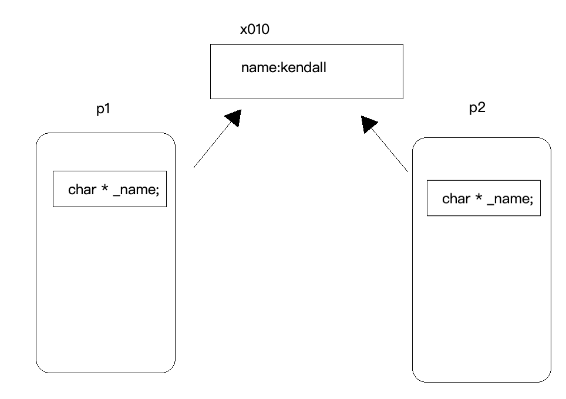
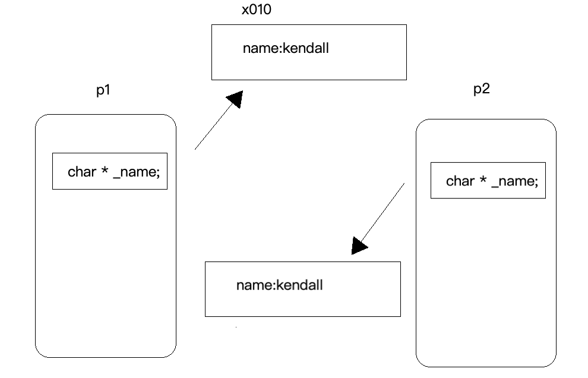

浅拷贝：又称值拷贝，将源对象的值拷贝到目标拷贝对象中去，本质上来说源对象和目标拷贝对象共用一份实体，只是所引用的变量名不同，地址其实还是相同的。举个简单的例子：你的小名叫kendall，大名叫Kge，当别人叫你西西或者沫沫的时候你都会答应，这两个名字虽然不相同，但是都指的是你。

先来看看下面这个程序
```js
#include <iostream>
#include <string>
using std::cout;
using std::endl;

class Person {
public:
    Person(const char * name = "")
    :_name(new char[strlen(name) + 1])
    {
        strcpy(_name,name);
    }
    //拷贝构造函数
    Person(const Person & p) {
        _name = p._name;
    }
    Person operator = (const Person & p) {
        if(this != &p) {
            this->_name = p._name;
        }
        return *this;
    }
    //析构函数
    ~Person() {
        if(_name) {
            delete[] _name;
            _name = NULL;
        }
    }
    void show() {
        cout << "name = " << _name << endl;
    }

private:
    char * _name;
};

void test1() {
    Person p1("kendall");
    Person p2(p1);
    p2.show();
}

int main() {

    test1();

    return 0;
}
```
运行结果报错：
```
name = kendall
a.out(5620,0x10be7c5c0) malloc: *** error for object 0x7fd8d6400690: pointer being freed was not allocated
a.out(5620,0x10be7c5c0) malloc: *** set a breakpoint in malloc_error_break to debug
Abort trap: 6
```
其实这个程序是存在什么问题呢？我们想一下，创建p2的时候程序必然会去调用拷贝构造函数，这时候拷贝构造仅仅只是完成了值拷贝，导致两个指针指向了同一块内存区域。随着程序的运行结束，又去调用析构函数，先是s2去调用析构函数，释放了它所指向的内存区域，接着s1又去调析构函数，这时候析构函数企图释放一块已经被释放的内存区域，程序将会崩溃。s1和s2的关系是这样的。



所以程序会崩溃是应该的。那这个问题应该怎么去解决呢？这就引出了深拷贝。

深拷贝，拷贝时先开辟出和源对象大小一样的空间，然后将源对象里的内容拷贝到目标拷贝对象中去，这样两个指针就指向了不同的内存位置，并且里面的内容还是一样的，这样不但达到了我们想要的目的，还不会出现问题，两个指针先后去调用析构函数，分别释放自己所指向的位置。即为每次增加一个指针，便申请一块新的内存，并让这个指针指向新的内存，深拷贝情况下，不会出现重复释放同一块内存的错误。

深拷贝实际上是这样的：




参考：https://blog.csdn.net/qq_39344902/article/details/79798297