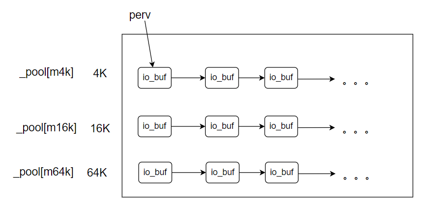

## 1.内存管理


- io_buf.h

```c
#pragma once

/**
 * 定义一个 buffer 一块内存的数据结构体
 * */

class io_buf
{
public:
	//定义成员方法
	//构造函数，创建一个size大小的buf
	io_buf(int size);

	//清空数据
	void clear();

	// 处理长度len的数据，移动head
	void pop(int len); //len表示已经处理的数据的长度

	//将已经处理的数据清空（内存抹去），将未处理的数据 移动至 buf 的首地址，length会减小
	void object();

	//将其他的 io_buf 对象拷贝到自己中
	void copy(const io_buf *const);

	//======> 定义成员变量

	//当前buf的总容量
	int capacity;

	//当前buf的有效数据长度
	int length;

	//当前未处理有效长度的头部索引
	int head;

	//当前buf内存的首地址
	int data;

	//存多个 io_buf 采用链表的形式进行管理
	io_buf *next;

}
```

- io_buf.cpp

```cpp
#include <stdio.h>
#include <assert.h>
#include <string.h>

#include "io_buf.h"

//构造函数，创建一个size大小的buf
io_buf::io_buf(int size){
	capacity = size;
	length = 0;
	head = 0;
	next = NULL;

	data = new char[size];

	//断言
	//assert宏的原型定义在<assert.h>中，其作用是如果它的条件返回错误，则终止程序执行
	//原型：void assert( int expression );
	assert(data);//如果data==NULL 那么程序直接退出，而不是崩溃
}

//清空数据
void io_buf::clear(){
	length = head = 0;

}

// 处理长度len的数据，移动head
void io_buf::pop(int len) //len表示已经处理的数据的长度
{
	length -= len;
	head += len;
}

//将已经处理的数据清空（内存抹去），将未处理的数据 移动至 buf 的首地址，length会减小
void io_buf::object(){
	if(head != 0){
		//length == 0 代表全部的数据已经处理完
		if(length != 0){
			//原型：extern void *memmove(void *dest, const void *src, unsigned int count);
			// 由src所指内存区域复制count个字节到dest所指内存区域。
			//注意：src和dest所指内存区域可以重叠，但复制后dest内容会被更改。函数返回指向dest的指针。
			memmove(data,data+head,length);  // #include <string.h>
		}
		head = 0;
	}
}

//将其他的 io_buf 对象拷贝到自己中  具体细节见下图
void io_buf::copy(const io_buf *other){
	//  void *mempcpy(void *dest, const void *src, size_t n);
	//函数的功能是拷贝src所指的内存内容前n个字节到dest所指的地址上。
	mempcpy(data,other->data + other->head,other->length);
	head = 0;
	length = other->length;
}
```


编译：`make`

## 2.内存池结构buf_pool

### 2.1 buf_pool 初始化

首先实现单例模式，保证全局唯一

- buf_pool.h

```cpp
#pragma once

#include "io_buf.h"
#include <ext/hash_map>
#include <stdint.h>  //使用 uint64_t

//定义hash_map数据类型
// __gnu_cxx::bash_map<int io_buf*>;
// 设置为自定义类型
typedef __gnu_cxx::hash_map<int, io_buf*> pool_t;

//定义一些内存的刻度
enum MEM_CAP {
    m4K = 4096,
    m16K = 16384,
    m64K = 65536,
    m256K = 262144,
    m1M = 1048576,
    m4M = 4194304,
    m8M = 8388608,
};

// 总内存池的大小限制，单位是kb
#define MEM_LIMIT (5U * 1024 *1024);

class buf_pool
{
public:
	//初始化单例对象
	static void init()
	{
		_instance = new buf_pool();
	}
	//提供一个静态获取 instance 的方法
	static buf_pool * instance()
	{
		//保证init方法在进程的生命周期只执行一次
		pthread_once(&_once,init);
		return _instance;
	}

	//从内存池中申请一块内存
	io_buf *allow_buf(int N);
	io_buf *allow_buf();

	//重置一个io_buf放回pool中
	void revert(io_buf *buffer);

private:
	// =========== 创建单例模式 ========
	//构造函数私有化
	buf_pool();
	buf_pool(const buf_pool&);
	const buf_pool& operator=(const buf_pool&);
	//单例的对象
	static buf_pool * _instance;
	//用于保证创建单例的一个方法全局只能执行一次
	static pthread_once_t _once;

	// ================ buf_pool 属性 ===============
	//存放所有io_buf的map句柄
	pool_t _pool;

	//当前内存池
	uint64_t _total_mem;  //#include <stdint.h> 
};
```

- buf_pool.cpp

```cpp
#include "buf_pool.h"
#include <stdio.h>


//单例的对象
buf_pool * buf_pool::_instance = NULL;  //懒汉模式

//用于保证创建单例的一个方法全局只能执行一次
pthread_once_t buf_pool::_once = PTHREAD_ONCE_INIT;

// 内存池的key-value形式
//buf_pool --> [m4K] ---> (io_buf)..io_buf..io_buf
//             [m16K] --> io_buf ..io_buf ..io_buf
//   
// 构造函数私有化
buf_pool::buf_pool(){

	// 链表的头指针
	io_buf *prev;

	//开辟4k buf内存池 (首地址)  ==> 具体分析见下图
	_pool[m4K] = new io_buf(m4K);
	if(_pool[m4K] == NULL){
		fprintf(stderr, "new io_buf m4K error");
        exit(1);
	}
	//prev 指针和 _pool[m4K] 都执行链表的首节点
	prev = _pool[m4K];
	//4k的buf  预先开辟5000个，约20M供开发者使用
	for(int i=1;i<5000;++i){
		prev->next = new io_buf(m4K);
		if(prev->next == NULL)
		{
			fprintf(stderr,"new io_buf m16k error");
			exit(1);
		}
	}

	_total_mem += 4*5000;
	//=== 以上将4k大小的io_buf全部开辟完

	//开辟16k buf内存池
	_pool[m16K] = new io_buf(m16K);
	if(_pool[m16K] == NULL){
		fprintf(stderr, "new io_buf m16K error");
        exit(1);
	}
	prev = _pool[m16K];
	for(int i=0;i<1000;++i)
	{
		prev->next = new io_buf(m16K);
		if(prev->next ==NULL){
			fprintf(stderr,"new io_buf m16k error");
		}
	}
	_total_mem += 16*1000;

	//开辟64k buf内存池
	_pool[m64K] = new io_buf(m64K);
	if(_pool[m64K] == NULL) {
		fprintf(stderr,"new io_buf m64k error");
		exit(1);
	}
	prev = _pool[m64K];
	for(int i=0;i<200;++i){
		prev->next = new io_buf(m64K);
		if(_pool[m64K] == NULL){
			fprintf(stderr,"new io_buf m64k error");
			exit(1);
		}
	}
	_total_mem += 64*200;

	//开辟 256K buf内存池
	_pool[m256K] = new io_buf(m256K);
	if(_pool[m256K] == NULL) {
		fprintf(stderr,"new io_buf m256K error");
		exit(1);
	}
	prev = _pool[m256K];
	for(int i=0;i<200;++i){
		prev->next = new io_buf(m256K);
		if(_pool[m256K] == NULL){
			fprintf(stderr,"new io_buf m256K error");
			exit(1);
		}
	}
	_total_mem += 256*200;
	
	//开辟 m1M buf内存池
	_pool[m1M] = new io_buf(m1M);
	if(_pool[m1M] == NULL) {
		fprintf(stderr,"new io_buf m256K error");
		exit(1);
	}
	prev = _pool[m1M];
	for(int i=0;i<20;++i){
		prev->next = new io_buf(m1M);
		if(_pool[m1M] == NULL){
			fprintf(stderr,"new io_buf m1M error");
			exit(1);
		}
	}
	_total_mem += 1024 * 20;
}

//从内存池中申请一块内存
io_buf buf_pool::*allow_buf(int N)
{
	return NULL;
}
io_buf buf_pool::*allow_buf()
{
	return NULL;	
}

//重置一个io_buf 放回pool中
void buf_pool::revert(io_buf *buffer)
{

}
```



### 2.1 buf_pool改进


