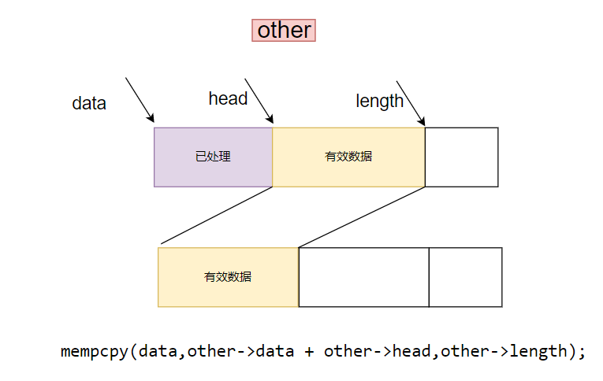

## 1.内存管理与 buffer 的封装

我们需要插入一个 `io_buf` 类，主要用来封装`buffer`的基本结构，然后用`buf_pool`来管理全部的`buffer`集合。

### 1.1 io_buf 内存块设计

`io_buf`的属性包括：

- 容量`capacity`
- 有效数据长度`length`
- 指向未处理的数据首地址（索引）head
- 当前内存块的首地址`data`
- `io_buf`指针 `next`,使用多个`io_buf`,采用链表的形式进行管理

`io_buf`类的方法：

- `pop(int len)`,len表示已经处理的数据长度
- `clear()` 清空当前内存，注意这里不是`free`掉物理内存，而是指针清空，`lenght = head = 0;`
- `adject()` 将`head`重置，将有效数据前置到`data`指针下
- `copy(io_buf *other)` 将`other`的有效数据拷贝到自身中（复制）


- io_buf.h

```cpp
#pragma once

// 设计一个 buffer内存块的数据结构

class io_buf 
{
public:
	//========== 成员方法

	//构造函数，传入一个buf的大小
	io_buf(int size);

	//处理数据
	void pop(int len);  

	//清空数据
	void clear();

	//调整数据，经已经处理的数据抹去，将未处理的数据移动至buf首地址
	void adjust();

	//将other的有效数据复制到拷贝到自身中
	void copy(const io_buf *other);
	
	//========== 成员变量

	//当前buf的首地址
	char * data;
	//当前buf的总容量
	int capacity;
	//未处理数据的索引位置
	int head;
	//未处理数据（有效数据的长度）
	int length;
	// 指向下一个io_buf的指针
	io_buf *next;
};
```

- io_buf.cpp

```cpp
#include <io_buf.h>
#include <iostream>
#include <stdio.h>
#include <string.h>

//构造函数，传入一个buf的大小
io_buf::io_buf(int size){
	//进行初始化
	data = new char[size];
	capacity = 0;
	head = 0;
	length = 0;
	next = NULL;
}

//处理数据
void io_buf::pop(int len){
	head += len;
	length -= len;
}

//清空数据
void io_buf::clear(){
	head = 0;
	length = 0;
}

//调整数据，经已经处理的数据抹去，将未处理的数据移动至buf首地址
void io_buf::adjust(){
	if(head != 0) {
		if(length != 0) {
			//  void *memmove(void *dest, const void *src, size_t n);
			//从src 移动到 dest ,注意第二个参数不是head,而是data+head,指向head索引位置的指针
			// 注意：src和dest所指内存区域可以重叠，但复制后dest内容会被更改。函数返回指向dest的指针。
			memmove(data,data+head,length);
		}
	}
}

//将other的有效数据复制到拷贝到自身中 具体见下图
void io_buf::copy(const io_buf *other){
	//void *mempcpy(void *dest, const void *src, size_t n);
	//函数的功能是拷贝src所指的内存内容前n个字节到dest所指的地址上。
	mempcpy(data,other->data+other->head,other->length);
	head = 0;
	length = other->length;
}
```



这里主要要注意`io_buf`的两个索引值`length`和`head`，一个是当前`buffe`r的有效内存长度，haed则为可用的有效长度首数据位置。 `capacity`是`io_buf`的总容量空间大小。

​	所以每次`pop()`则是弹出已经处理了多少，那么buffer剩下的内存就接下来需要处理的。

​	然而`adjust()`则是从新重置`io_buf`,将所有数据都重新变成未处理状态。

​	`clear()`则是将`length`和`head`清`0`，这里没有提供`delete`真是删除物理内存的方法，因为这里的buffer设计是不需要清理的，接下来是用一个`buf_pool`来管理全部未被使用的`io_buf`集合。而且`buf_pool`的管理的内存是程序开始预开辟的，不会做清理工作.

### 1.2 buf_pool 内存池设计与实现

使用`k-v`格式来存储内存池中的内存块。其中：、
- `key`: 刻度值
- `value`：当前刻度下所挂载的`io_buf`链表


**`buf_pool`中的属性**：

- 内存池的数据句柄`map`
	- `key`:内存块刻度
	- `value`:当前刻度下所挂载的`io_buf`链表

- 内存池的总大小`total_num`

为了保证在内存池类创建的对象全局唯一，因此需要使用单例模式。

单例模式涉及到一个单一的类，该类负责创建自己的对象，同时确保只有单个对象被创建。这个类提供了一种访问其唯一的对象的方式，可以直接访问，不需要实例化该类的对象。

>简单步骤：
>
>将构造函数和析构函数私有化，然后在类内部自己实现方法来创建对象。

- buf_pool.h

```cpp

```