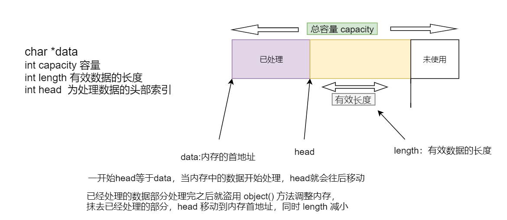
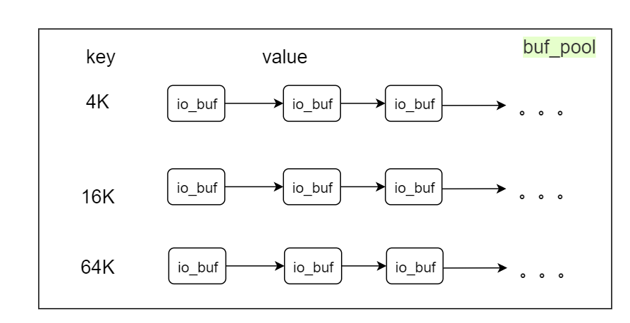
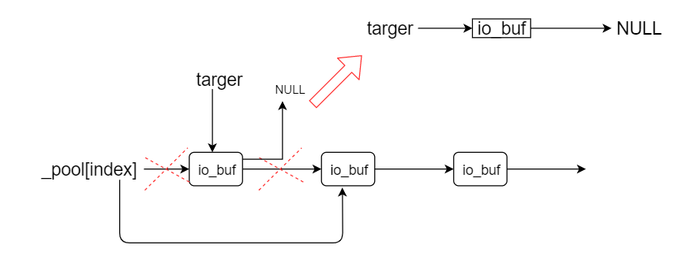

## 1.内存管理与 buffer 的封装

我们需要插入一个 `io_buf` 类，主要用来封装`buffer`的基本结构，然后用`buf_pool`来管理全部的`buffer`集合。

### 1.1 io_buf 内存块设计

`io_buf`的属性包括：

- 容量`capacity`
- 有效数据长度`length`
- 指向未处理的数据首地址（索引）head
- 当前内存块的首地址`data`
- `io_buf`指针 `next`,使用多个`io_buf`,采用链表的形式进行管理

`io_buf`类的方法：

- `pop(int len)`,len表示已经处理的数据长度
- `clear()` 清空当前内存，注意这里不是`free`掉物理内存，而是指针清空，`lenght = head = 0;`
- `adject()` 将`head`重置，将有效数据前置到`data`指针下
- `copy(io_buf *other)` 将`other`的有效数据拷贝到自身中（复制）



- io_buf.h

```cpp
#pragma once

// 设计一个 buffer内存块的数据结构

class io_buf 
{
public:
	//========== 成员方法

	//构造函数，传入一个buf的大小
	io_buf(int size);

	//处理数据
	void pop(int len);  

	//清空数据
	void clear();

	//调整数据，经已经处理的数据抹去，将未处理的数据移动至buf首地址
	void adjust();

	//将other的有效数据复制到拷贝到自身中
	void copy(const io_buf *other);
	
	//========== 成员变量

	//当前buf的首地址
	char * data;
	//当前buf的总容量
	int capacity;
	//未处理数据的索引位置
	int head;
	//未处理数据（有效数据的长度）
	int length;
	// 指向下一个io_buf的指针
	io_buf *next;
};
```

- io_buf.cpp

```cpp
#include <io_buf.h>
#include <iostream>
#include <stdio.h>
#include <string.h>

//构造函数，传入一个buf的大小
io_buf::io_buf(int size){
	//进行初始化
	data = new char[size];
	capacity = 0;
	head = 0;
	length = 0;
	next = NULL;
}

//处理数据
void io_buf::pop(int len){
	head += len;
	length -= len;
}

//清空数据
void io_buf::clear(){
	head = 0;
	length = 0;
}

//调整数据，经已经处理的数据抹去，将未处理的数据移动至buf首地址
void io_buf::adjust(){
	if(head != 0) {
		if(length != 0) {
			//  void *memmove(void *dest, const void *src, size_t n);
			//从src 移动到 dest ,注意第二个参数不是head,而是data+head,指向head索引位置的指针
			// 注意：src和dest所指内存区域可以重叠，但复制后dest内容会被更改。函数返回指向dest的指针。
			memmove(data,data+head,length);
		}
	}
}

//将other的有效数据复制到拷贝到自身中 具体见下图
void io_buf::copy(const io_buf *other){
	//void *mempcpy(void *dest, const void *src, size_t n);
	//函数的功能是拷贝src所指的内存内容前n个字节到dest所指的地址上。
	mempcpy(data,other->data+other->head,other->length);
	head = 0;
	length = other->length;
}
```


这里主要要注意`io_buf`的两个索引值`length`和`head`，一个是当前`buffe`r的有效内存长度，haed则为可用的有效长度首数据位置。 `capacity`是`io_buf`的总容量空间大小。

​	所以每次`pop()`则是弹出已经处理了多少，那么buffer剩下的内存就接下来需要处理的。

​	然而`adjust()`则是从新重置`io_buf`,将所有数据都重新变成未处理状态。

​	`clear()`则是将`length`和`head`清`0`，这里没有提供`delete`真是删除物理内存的方法，因为这里的buffer设计是不需要清理的，接下来是用一个`buf_pool`来管理全部未被使用的`io_buf`集合。而且`buf_pool`的管理的内存是程序开始预开辟的，不会做清理工作.

### 1.2 buf_pool 内存池设计与实现

使用`k-v`格式来存储内存池中的内存块。其中：、
- `key`: 刻度值
- `value`：当前刻度下所挂载的`io_buf`链表



**`buf_pool`中的属性**：

- 内存池的数据句柄`map`
	- `key`:内存块刻度
	- `value`:当前刻度下所挂载的`io_buf`链表

- 内存池的总大小`total_num`

**`buf_pool`中的方法**：

- 构造函数 `buf_pool()`,初始化全部内存，将全部刻度的内存一次性`new`出来.

- 开辟`io_buf`,这不是一个`new`操作，而是从`map`中选取一个合适的`io_buf`返回。
  
- 将一个已经使用完的`io_buf`重置放回`buf_pool`中。

为了保证在内存池类创建的对象全局唯一，因此需要使用单例模式。

单例模式涉及到一个单一的类，该类负责创建自己的对象，同时确保只有单个对象被创建。这个类提供了一种访问其唯一的对象的方式，可以直接访问，不需要实例化该类的对象。

>简单步骤：
>
>将构造函数和析构函数私有化，然后在类内部自己实现方法来创建对象。


#### `pthread_once()`函数详解

> 补充：`pthread_once()`函数详解			
> 在多线程环境中，有些事执行一次，通常当初始化应用程序时，可以比较容易地将其放在`main`函数中,但是当写一个库时，就不能再`main`里面初始化了，可以用静态初始化，但使用一次初始化（`pthread_once`）会比较容易些。
> 
> `int pthread_once(pthread_once_t *once_control, void (*init_routine) (void))；`
> 
> 功能：本函数使用初值为`PTHREAD_ONCE_INIT`的`once_control`变量保证`init_routine()`函数在本进程执行序列中仅执行一次。
> 
> 在多线程编程环境下，尽管`pthread_once()`调用会出现在多个线程中，`init_routine()`函数仅执行一次，究竟在哪个线程中执行是不定的，是由内核调度来决定。
> 
> `Linux Threads`使用互斥锁和条件变量保证由`pthread_once()`指定的函数执行且仅执行一次，而`once_control`表示是否执行过。
>
> 如果`once_control`的初值不是`PTHREAD_ONCE_INIT`（`Linux Threads`定义为`0`），`pthread_once()` 的行为就会不正常。
>
> 在`LinuxThreads`中，实际"一次性函数"的执行状态有三种：`NEVER（0）`、`IN_PROGRESS (1)`、`DONE (2)`，如果`once`初值设为`1`，则由于所有`pthread_once()`都必须等待其中一个激发"已执行一次"信号，因此所有`pthread_once ()`都会陷入永久的等待中；如果设为`2`，则表示该函数已执行过一次，从而所有`pthread_once()`都会立即返回`0`。

- buf_pool.h

```cpp
#pragma once

#include <ext/hash_map>
#include <io_buf.h>
#include <pthread.h>

//自定义map类型
typedef __gnu_cxx::hash_map<int,io_buf*> pool_t;

//定义一些内存的刻度
enum MEM_CAP {
    m4K = 4096,
    m16K = 16384,
    m64K = 65536,
    m256K = 262144,
    m1M = 1048576,
    m4M = 4194304,
    m8M = 8388608,
};

class buf_pool 
{
public:
	//初始化单例对象，（创建一个唯一对象）
	static void init() {
		_instance = new buf_pool();		
	}
	//提供一个静态方法获取_instance（buf_pool对象）方法
	static buf_pool * instance() {
		
		//调用init，保证init方法在进程的生命周期中只执行一次
		//int pthread_once(pthread_once_t *once_control, void (*init_routine) (void))；
		pthread_once(_once,init);
		return _instance;
	}

	//====== 主要方法 ====== 

	//1 从内存池中申请一个内存块 N 为需要申请的内存大小
	io_buf *alloc_buf(int N);
	io_buf *alloc_buf();  //不指定大小就为默认的4kb

	//2 重置一个io_buf内存块，放回buf_pool中
	void revert(io_buf * buffer);

	//这里封装一个内存刻度定制的方法，方便申请开辟内存块，cap:刻度值，num:数目
	void make_io_buf_list(int cap,int num);
	 
private:
	// ===== 创建单例模式 ===========

	//构造函数
	buf_pool();
	buf_pool(const buf_pool&);

	//析构函数
	~buf_pool();

	//创建单例对象，保证创建的对象唯一
	static buf_pool *_instance;

	// ======= buf_pool 的属性 ===========
	//存放io_buf的map句柄
	pool_t _pool;

	//为了保证单例模式自动释放并保证线程安全
	//使用pthread_t_once 保证单例的一个方法只能执行一次
	static pthread_once_t *_once;

	// 当前内存的总大小，单位是kb
	u_int64_t _total_mem;

	//保护pool map增删改查的锁 保证线程安全
	static pthread_mutex_t _mutex;
}
```

首先 `buf_pool` 采⽤单例的⽅式进⾏设计。因为系统希望仅有⼀个内存池管理模块。这⾥里内存池用⼀个 `__gnu_cxx::hash_map<int, io_buf*>` 的`map`类型进⾏行管理，其中`key`是每个组内存的空间容量，参考

```cpp
enum MEM_CAP {
	m4K = 4096,
	m16K = 16384,
	m64K = 65536,
	m256K = 262144,
	m1M = 1048576,
	m4M = 4194304,
	m8M = 8388608
};
```

其中每个`key`下面挂在一个`io_buf`链表。而且`buf_pool`预先会给`map`下的每个`key`的内存组开辟好一定数量的内存块。然后上层用户在使用的时候每次取出一个内存块，就会将该内存块从该内存组摘掉。当然使用完就放回来。如果不够使用会额外开辟，也有最大的内存限制，在宏`EXTRA_MEM_LIMIT`中。

具体的`buf_pool.cpp`实现如下:

- buf_pool.cpp

```cpp
#include <buf_pool.h>
#include <stdio.h>
#include <assert.h>


//静态成员初始化
buf_pool * buf_pool::_instance = NULL;  //懒汉模式

//保证单例的每个方法只执行一次
pthread_once_t buf_pool::_once = PTHREAD_ONCE_INIT;

//保护pool map增删改查的锁 保证线程安全
pthread_mutex_t buf_pool::_mutex = PTHREAD_MUTEX_INITIALIZER;

//实现刻度机制 见图 1
void buf_pool::make_io_buf_list(int cap,int num){
	//链表的头指针
	io_buf * prev;

	_pool[cap] = new io_buf(cap);
	if(_pool[cap] == NULL) {
		fprintf(stderr,"new io buf %d error'n",cap);
		exit(1);
	}
	prev = _pool[cap];
	for(int i=1;i<=num;++i) {
		prev->next = new io_buf(cap);
		if(prev->next == NULL) {
			fprintf(stderr,"new io buf %d error'n",cap);
			exit(1);
		}
		prev = prev->next;
	}
	_total_mem = cap/1024 * num;
	
}

//构造函数的实现 主要是预先开辟一定量的空间
//这里buf_pool是一个hash，每个key都是不同空间容量
//对应的value是一个io_buf集合的链表
//buf_pool -->  [m4K] -- io_buf-io_buf-io_buf-io_buf...
//              [m16K] -- io_buf-io_buf-io_buf-io_buf...
//              [m64K] -- io_buf-io_buf-io_buf-io_buf...
//              [m256K] -- io_buf-io_buf-io_buf-io_buf...
//              [m1M] -- io_buf-io_buf-io_buf-io_buf...
//              [m4M] -- io_buf-io_buf-io_buf-io_buf...
//              [m8M] -- io_buf-io_buf-io_buf-io_buf...
buf_pool::buf_pool()
:_total_mem(0)
{
    make_io_buf_list(m4K, 5000);
    make_io_buf_list(m16K, 1000);
    make_io_buf_list(m64K, 500);
    make_io_buf_list(m256K,200);
    make_io_buf_list(m1M, 50);
    make_io_buf_list(m4M, 20);
    make_io_buf_list(m8M, 10);
	
}

// 从内存池中申请一块内存
io_buf *buf_pool::alloc_buf(int N) {
	int index;
	// 1 找到N最接近的 一个刻度链表 返回一个io_buf
    if(N <= m4K){
        index = m4K;
    }
    else if(N <= m16K){
        index = m16K;
    }
    else if(N <= m64K){
        index = m64K;
    }
    else if(N <= m256K){
        index = m256K;
    }
    else if(N <= m1M){
        index = m1M;
    }
    else if(N <= m4M){
        index = m4M;
    }
    else if(N <= m8M){
        index = m8M;
    }
    else {
        return NULL;
    }
	//2 如果这个index没有了需要额外申请
	pthread_mutex_lock(&_mutex);
	if(_pool[index] == NULL) {
		//当前开辟的空间已经超过了最大限制
        if ( _total_mem + index/1024 >= MEM_LIMIT ) {
            fprintf(stderr, "already use too many memory!\n");
            exit(1);
        }
		io_buf *new_buf = new io_buf(index);
		if(new_buf == NULL) {
            fprintf(stderr,"new io_buf error\n");
            exit(1);
		}
		_total_mem += 1024/index;
		pthread_mutex_unlock(&_mutex);
		return new_buf;
	}

	//如果index有内存，从pool中拆除一块内存返回
	//见下图 2
	io_buf *targer = _pool[index];
	_pool[index] = targer->next;
	targer->next = NULL;
	return targer;
}
//如果不指定大小，就开辟m4K
io_buf *buf_pool::alloc_buf(){
	return alloc_buf(m4K);
}

//重置一个io_buf,放回pool中
void buf_pool::revert(io_buf * buffer) {
	//将buffer放回pool汇总
	//index是属于pool中哪个链表的
	int index = buffer->capacity;

	buffer->length = 0;
	buffer->head = 0;

	pthread_mutex_lock(&_mutex);
	//断言，一定能够找到index
	assert(_pool.find(index) != _pool.end());
#if 0
	if(_pool.find(index) == _pool.end()) {
		exit(1);
	}
#endif

	//将buffer设置为对应buf链表的首节点 插在前面
	buffer->next = _pool[index];
	_pool[index] = buffer;

	pthread_mutex_unlock(&_mutex);
}
```
- 图1
  


- 图2



## 2.读写 buffer 机制

