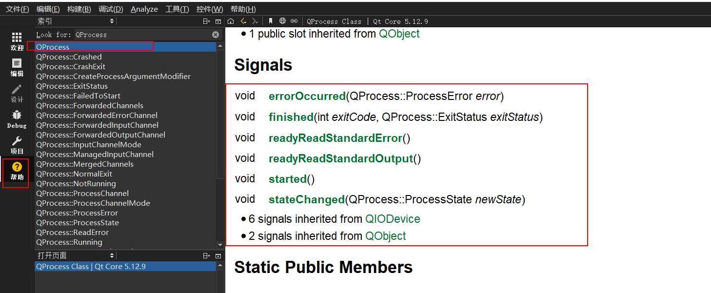

## 1.Android 调试桥

`Android` 调试桥 (`adb`) 是一个通用命令行工具，其允许您与模拟器实例或连接的 `Android` 设备进行通信。它可为各种设备操作提供便利，如安装和调试应用，并提供对 `Unix shell`（可用来在模拟器或连接的设备上运行各种命令）的访问。该工具作为一个客户端-服务器程序，包括三个组件：

- `adb`客户端，该组件发送命令。`adb`客户端在开发计算机上运行。我们可以通过从命令行运行`adb`客户端来发送命令。
- `adb`服务器，该组件管理客户端和后台程序之间的通信。`adb`服务器在开发计算机上作为后台进程运行。
- `adbd`服务器，该组件在设备上运行命令。`adbd`服务器在每个模拟器或设备实例上作为后台进程运行。

更详细的介绍请查看：

>https://developer.android.com/studio/command-line/adb

>https://github.com/mzlogin/awesome-adb

## ADB 安装

以下是 `ADB` 和 `Fastboot` 的谷歌官方下载链接：

`ADB`和`Fastboot for Windows`

> https://dl.google.com/android/repository/platform-tools-latest-windows.zip

`ADB`和`Fastboot for Mac`

> https://dl.google.com/android/repository/platform-tools-latest-darwin.zip


下载 `adb` 后解压即可使用

## 2.ADB 工作原理

启动一个 `adb` 客户端时，此客户端首先检查是否有已运行的 `adb` 服务器进程。如果没有，它将启动服务器进程。当服务器启动时，它与本地 `TCP` 端口 `5037` 绑定，并侦听从 `adb` 客户端发送的命令—所有 `adb `客户端均使用端口 `5037` 与 `adb` 服务器通信。


## 3.启用 adb 调试

> 在安卓手机上-> 设置 --> 关于手机 --> 版本号（点击7次启动开发者模式） --> 系统更新 --> 开发者选项 --> 启动仅充电情况下允许 `ADB` 调试。

- 启动 `ADB` 服务

```
 ./adb start-server
```

- 查看已经连接设备

```
/platform-tools_r31.0.0-windows/platform-tools$ ./adb devices
```
- 关闭 `ADB` 服务
  
```
$ ./adb kill-server
```

- 查看`5037`端口有没有被占用

```
netstat -ano | findstr 5037
taskkill /pid 5037 /f
```

- 上传文件到手机上
```
adb push 'C:\Users\ThinkPad\Desktop\aaa.txt' /sdcard/aaa.txt
```

- 使用 shell 命令

```bash
 adb shell ls

 adb shell
 ls
```

- 使用 USB 电缆将设备连接到主计算机。

- 设置目标设备以侦听端口 5555 上的 TCP/IP 连接。

  `$ adb tcpip 5555`

- 从目标设备断开 USB 电缆连接。

- 查找 Android 设备的 IP 地址。例如，在 Nexus 设备上，您可以通过访问 Settings > About tablet（或 About phone) > Status > IP address 查找 IP 地址。或者，在 Android Wear 设备上，您可以通过访问 Settings > Wi-Fi Settings > Advanced > IP address 查找 IP 地址。

- 连接至设备，通过 IP 地址识别此设备。

  `$ adb connect device_ip_address`

```
adb connect 192.168.0.103:5555
already connected to 192.168.0.103:5555

adb devices
List of devices attached
192.168.0.103:5555      device

adb -s 192.168.0.103:5555 push 'C:\Users\ThinkPad\Desktop\aaa.txt' /sdcarda/aaa.txt
```

- 断开连接

```
adb disconnect 192.168.0.103:5555
```

## 3.Qt 开发

新建项目 --> 选择 Qt Widgets Application --> QDialog --> 


添加按钮测试：
```cpp
//#include <QProcess>
#include "AdbProcess.h"

#include "dialog.h"
#include "ui_dialog.h"

Dialog::Dialog(QWidget *parent)
    : QDialog(parent)
    , ui(new Ui::Dialog)
{
    ui->setupUi(this);
}

Dialog::~Dialog()
{
    delete ui;
}


void Dialog::on_testBtn_clicked()
{

    QString program = "notepad";  //使用的应用程序
    QStringList arguments;
    arguments << "C:\\Users\\ThinkPad\\Desktop\\aaa.txt";   //打开的文件

    AdbProcess *myProcess = new AdbProcess(this);
    myProcess->start(program, arguments);
//    myProcess->start(program,Q_NULLPTR);

}
```

编写自己的 `AdbProcess.h`

```cpp
#ifndef ADBPROCESS_H
#define ADBPROCESS_H
#include <QProcess>

class AdbProcess : public QProcess
{
public:
    AdbProcess(QObject *parent = Q_NULLPTR);
};

#endif // ADBPROCESS_H

```

测试`adb.exe`

```cpp
//#include <QProcess>
#include "AdbProcess.h"

#include "dialog.h"
#include "ui_dialog.h"

Dialog::Dialog(QWidget *parent)
    : QDialog(parent)
    , ui(new Ui::Dialog)
{
    ui->setupUi(this);
}

Dialog::~Dialog()
{
    delete ui;
}


void Dialog::on_testBtn_clicked()
{

    QString program = "..\\thrid_party\\adb\\win\\adb.exe";  //使用的应用程序
    QStringList arguments;
    arguments << "C:\\Users\\ThinkPad\\Desktop\\aaa.txt";   //打开的文件

    AdbProcess *myProcess = new AdbProcess(this);
//    myProcess->start(program, arguments);
    myProcess->start(program,Q_NULLPTR);

}
```
测试运行发现没有反应

查看 `QProcess` 有哪些信号接口




- 封装函数

```cpp
void execute(const QString& serial, const QStringList& args);
```

```cpp
	//给一些错误提示
    enum ADB_EXEC_RESULT {
        AER_SUCCESS_START,          // 启动成功
        AER_ERROR_START,            // 启动失败
        AER_SUCCESS_EXEC,           // 执行成功
        AER_ERROR_EXEC,             // 执行失败
        AER_ERROR_MISSING_BINARY,   // 找不到文件
    };
```

QT信号槽

```cpp
void push(const QString& serial, const QString& local, const QString& remote);
```

移除手机上的文件

```cpp
void removePath(const QString& serial, const QString& path);
```

建立和移除反向代理
```cpp
    void reverse(const QString& serial, const QString& deviceSocketName, quint16 localPort);
    void reverseRemove(const QString& serial, const QString& deviceSocketName);
```

列出当前所有的反向代理
```
adb reverse --list
```

封装获取序列号接口
```cpp
StringList getDevicesSerialFromStdOut();
```

## sever模块

1. 将scrcpy-server推送到手机（adb push）
2. 启动反向代理（adb reverse）
3. pc端监代理的端口
4. 启动scrcpy-server（adb shell app_process）
5. 接收scrcpy-server的连接，并进行通信

在项目中添加server模块

记得改配置文件

新建类

添加 `scrcpy-server.jar`到`thrid_party`

## ffmpeg 编解码

## 渲染模块
 opengl

 opengl渲染yuv


 ## 控制指令，通过PC 端控制手机端

 ## 完善界面

 ## 跨平台

 

