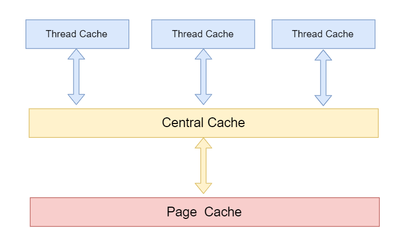

## 1. 项目背景

## 2.什么是内存池
内存池(`Memory Pool`)是一种动态分配和管理技术，通常情况下，我们习惯使用`new`、`delete`、`malloc`、`free`等 `API`申请分配和释放内存，这样导致的后果是：当程序长时间运行时，由于所申请内存块的大小不定，频繁使用时会造成大量的内存碎片从而降低程序和操作系统的性能。内存池就可以在真正使用内存之前，先申请分配一块大内存(内存池)留作备用，当我们申请内存时，从内存池中取出一块动态分配，当我们释放内存时，再把释放的内存再放入池中，再吃申请内存，可从内存池中取出来再次使用，并尽量与周边的空闲内存块合并。若内存池不够时，则自动扩大内存池，从操作系统中申请更大的内存池。

## 3.为什么需要内存池
### 3.1 内存碎片问题

造成堆利用率很低的一个主要原因就是内存碎片化。如果有未使用的存储器，但是这块存储器不能用来满足分配的请求，这时候就会产生内存碎片化问题。内存碎片化分为内部碎片和外部碎片。

- 内碎片
  
内部碎片是指一个已分配的块比有效载荷大时发生的。(假设以前分配了`10`个大小的字节，现在只用了`5`个字节，则剩下的`5`个字节就会内碎片)。内部碎片的大小就是已经分配的块的大小和他们的有效载荷之差的和。因此内部碎片取决于以前请求内存的模式和分配器实现(对齐的规则)的模式。

- 外碎片
  
**频繁的分配与回收物理页面会导致大量的、连续且小的页面块夹杂在已分配的页面中间，就会产生外部碎片**。假设有一块一共有100个单位的连续空闲内存空间，范围是0~99。如果你从中申请一块内存，如10个单位，那么申请出来的内存块就为0~9区间。这时候你继续申请一块内存，比如说5个单位大，第二块得到的内存块就应该为10~14区间。如果你把第一块内存块释放，然后再申请一块大于10个单位的内存块，比如说20个单位。因为刚被释放的内存块不能满足新的请求，所以只能从15开始分配出20个单位的内存块。现在整个内存空间的状态是0~9空闲，10~14被占用，15~24被占用，25~99空闲。其中0~9就是一个内存碎片了。如果10~14一直被占用，而以后申请的空间都大于10个单位，那么0~9就永远用不上了，变成外部碎片。

### 3.2 申请效率问题

例如：我们上学家里给生活费一样，假设一学期的生活费是6000块。

方式1：开学时6000块直接给你，自己保管，自己分配如何花。

方式2：每次要花钱时，联系父母，父母转钱。

同样是6000块钱，第一种方式的效率肯定更高，因为第二种方式跟父母的沟通交互成本太高了。

同样的道理，程序就像是上学的我们，操作系统就像父母，频繁申请内存的场景下，每次需要内存，都像系统申请效率必然有影响。

## 4.如何实现高并发内存池

现代很多的开发环境都是多核多线程，在申请内存的场景下，必然存在激烈的锁竞争问题。所以这次我们实现的内存池需要考虑以下几方面的问题。

- 解决内碎片问题，但是内碎片问题无法避免，只能尽可能的降低
- 由于向内存申请的内存块都是比较大的，所以能够降低外碎片问题
- 一次性向内存申请一块大的内存慢慢使用，避免了频繁的向内存请求内存操作，提高内存分配的效率

### 4.1 内存池的设计

#### 4.1.1 定长内存分配器

设计一个**定长内存分配器**，也就是实现一个`FreeList`，每个`FreeList`分配一个固定大小的内存块，比如用于分配`32`字节对象的固定内存分配器，每个固定内存分配器里面有两个链表，分别是：`OpenList` 和 `CloseList`。其中`OpenList` 用于存储未分配的空闲对象，`CloseList`用于存储已分配的内存对象，那么所谓的分配就是从 `OpenList` 中取出一个对象放到 `CloseList` 里并且返回给用户，释放又是从 `CloseList` 移回到 `OpenList`。分配时如果不够，那么就需要增长 `OpenList`：申请一个大一点的内存块，切割成比如 `64` 个相同大小的对象添加到 `OpenList`中。这个固定内存分配器回收的时候，统一把先前向系统申请的内存块全部还给系统。

这样设计的优点是简单粗暴，分配和释放的效率高，解决实际中特定场景下的问题有效。但是这样功能太单一了，只能解决定长的内存需求，另外存在站着内存没有被释放掉。


#### 4.1.2 哈希映射的`FreeList`内存池

在定长分配器的基础上，按照不同对象大小`(8，16，32，64，128，256，512，1k…64K)`,构造十多个固定内存分配器，分配内存时根据要申请内存大小进行对齐然后查`Hash`表，决定到底由哪个分配器负责，分配后要在内存头部的 `header` 处写上 `cookie`，表示由该块内存哪一个分配器分配的，这样释放时候你才能正确归还。如果大于`64K`，则直接用系统的 `malloc`作为分配，如此以浪费内存为代价你得到了一个分配时间近似`O(1)`的内存分配器。这种内存池的缺点是假设某个 `FreeList` 如果高峰期占用了大量内存即使后面不用，也无法支援到其他内存不够的 `FreeList`，达不到分配均衡的效果。

这个一定程度是对定长内存池的改进，分配和释放效率高，可以解决一定长度内的问题。

但是存在内碎片的问题，且将一块大内存切小以后，申请大内存无法使用。多线程并发场景下，锁竞争激烈，效率降低。

> `STL` 六大组件中的空间配置器就是基于这种思想

### 4.2 并发内存池

#### 4.2.1 项目概述

就上诉的问题而言，要解决锁的竞争，我们就不能在用户申请轻量级内存(`<=64k`)时对其加锁，另外要解决内存碎片问题，在用户用完内存后，要对内存解释回收，按需调度，此时设计三个模块解决上述问题。



- `ThreadCache`：线程缓存是每个线程独有的，用于`<=64k`的内存分配，线程从这里申请时，不需要加锁，且每个线程独享一个`Cache`，这就是这个并发线程池高效的地方。
  
- `Cen-tralCache`：中心缓存时所有线程所共享的,`ThreadCache`是按需从`CentraCache`索取内存对象，而`CentralCache`周期性的回收来自`ThreadCache`中的内存对象，避免一个线程长期占用太多的内存，而其他内存非常吃紧，达到了内存分配在多个线程中更加均衡的按需调度的目的，`CentralCache`是存在竞争的，所以这里有必要加锁，因为每次都给`ThreadCache`足够用的内存大小，所以并不会经常性向`CentralCache`索取内存，所以锁的竞争不会太激烈。

- `PageCache`：页缓存是在`CentrCache`上面的一层缓存着，存储的内存是以页为单位进行存储以及分配，`CentralCache`没有内存对象时，就申请从`PageCache`分配一定数量的`Page`，并切割成定长大小的小块内存，分配给`CentralCache`。`PageCache`会回收`CentralCache`满足条件的span对象，并且合并相邻的页，组成更大的页，进而实现解决内存碎片的问题。

**怎么实现每个线程都拥有自己唯一的线程缓存呢？**

为了避免加锁带来的效率，在`Thread Cache`中使用（`tls`）`thread local storage`保存每个线程本地的`Thread Cache`的指针，这样`Thread Cache`在申请释放内存是不需要锁的。因为每一个线程都拥有了自己唯一的一个全局变量。

`TLS`分为静态的和动态的：
- 静态的`TLS`是：直接定义
- 动态的`TLS`是：调用系统的API去创建的，这个项目里面用到的就是静态的`TLS`

#### 4.2.2 设计Thread Cache

- ThreadCache.h:

```cpp
#pragma once

#include "Common.h"

class ThreadCache
{
private:
	Freelist _freelist[NLISTS];//自由链表

public:
	//申请和释放内存对象
	void* Allocate(size_t size);
	void Deallocate(void* ptr, size_t size);

	//从中心缓存获取对象
	void* FetchFromCentralCache(size_t index, size_t size);

	//释放对象时，链表过长时，回收内存回到中心堆
	void ListTooLong(Freelist* list, size_t size);
};

//静态的，不是所有可见
//每个线程有个自己的指针, 用(_declspec (thread))，我们在使用时，每次来都是自己的，就不用加锁了
//每个线程都有自己的tlslist
_declspec (thread) static ThreadCache* tlslist = nullptr;
```

- 申请内存:

当内存申请`size<=64k`时在`Thread Cache`中申请内存，计算`size`在自由链表中的位置，如果自由链表中有内存对象时，直接从`FistList[i]`中`Pop`一下对象，时间复杂度是`O(1)`，且没有锁竞争。
当`FreeList[i]`中没有对象时，则批量从`Central Cache`中获取一定数量的对象，插入到自由链表并返回一个对象。

- 释放内存：

当释放内存小于64k时将内存释放回`Thread Cache`，计算`size`在自由链表中的位置，将对象`Push`到`FreeList[i]`.
当链表的长度过长，也就是超过一次向中心缓存分配的内存块数目时则回收一部分内存对象到`Central Cache`。


**如何计算一次申请多少个节点？**

用设置的最大除以申请的内存，如果申请的内存越大，就给的越少，相反，申请的越少，就一次性给你512份让你足够用，这样很大程度能够缓解锁的竞争问题！！！

```cpp
//计算一次申请多少个节点
static size_t NumMoveSize(size_t size)
{
    if (size == 0)
        return 0;

    int num = MAX_SIZE / size;
    if (num < 2)
        num = 2;

    if (num > 512)
        num = 512;

    return num;
}
```
**计算一次向系统申请多少页？**

```cpp
//计算一次向系统获取几个页
static size_t NumMovePage(size_t size)
{
    size_t num = NumMoveSize(size);
    size_t npage = num*size;

    npage >>= 12;
    if (npage == 0)
        npage = 1;

    return npage;
}
```

**如何分配定长记录？**

出于最大化内存利用率的目的，我们使用另一种经典的方式，`freelist`。将 `4KB` 的内存划分为 `16` 字节的单元，每个单元的前`8`个字节或者前`4`个字节作为节点指针，指向下一个单元。初始化的时候把所有指针指向下一个单元；分配时，从链表头分配一个对象出去；释放时，插入到链表。由于链表指针直接分配在待分配内存中，因此不需要额外的内存开销，而且分配速度也是相当快。

**如何分配变长记录？**

在这里把所有的变长记录进行“取整”，例如分配`7`字节，就分配`8`字节，`20`字节分配`32`字节，得到多种规格的定长记录。这里带来了内部内存碎片的问题，即分配出去的空间不会被完全利用，有一定浪费。为了减少内部碎片，分配规则按照 `8, 16, 32, 48, 64`这样子来。注意到，这里并不是简单地使用2的幂级数，因为按照2的幂级数，内存碎片会相当严重，分配`65`字节，实际会分配`128`字节，接近`50%`的内存碎片。而按照这里的分配规格，只会分配`80`字节，一定程度上减轻了问题。

#### 4.2.3 对齐大小的设计（对齐规则）


https://blog.csdn.net/qq_41562665/article/details/90546750

https://www.it610.com/article/1282785152086327296.htm

