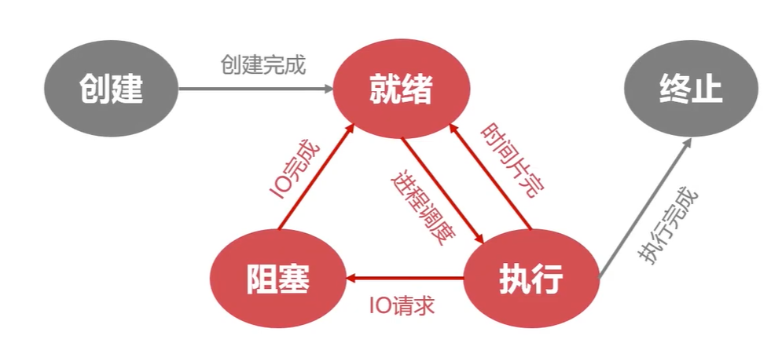
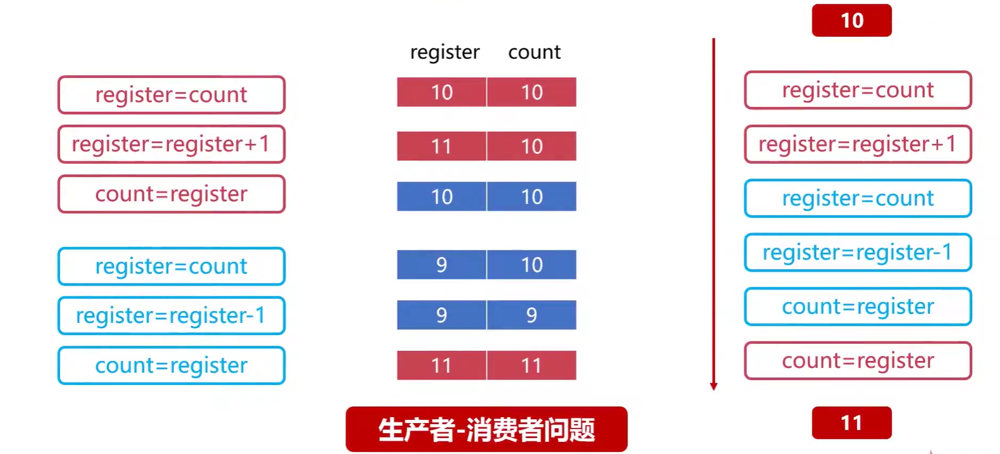
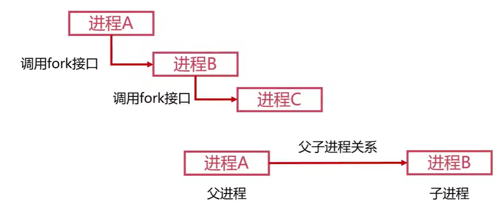
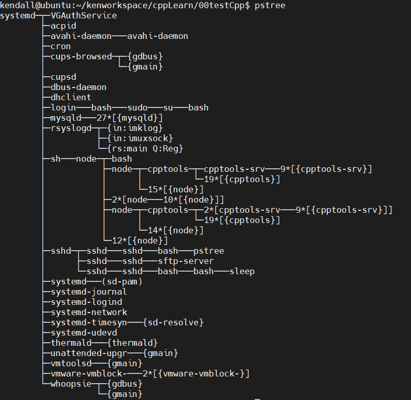

## 1.进程管理

进程是系统进行资源分配和调度的基本单位。

### 1.1进程的实体
- 主存中的进程形态
- 进程和线程

#### 1.1.1 主存中的进程形态

- 标识符：标记一个进程，用于区别其他进程，比如说进程ID
- 进程的状态：比如说运行态，堵塞态，有专门的区域存储进程状态
- 程序计数器： 指向进程即将要执行的下一条指令地址
- 内存指针，值得是程序代码或者数据相关的指针
- 上下文区域：进程执行的时候存储器存储的数据
- IO状态信息：被进程IO操作所占用的文件列表，进程中所有的信息都是以文件的形式存在的，比如说操作磁盘，文件，内存都是以文件的形式存储在IO状态信息里面
- 记账信息：存储处理器处理时间，时钟数总和等。

上面这些都是进程中的一个重要的区域

- **进程的控制块**（PCB）：用于描述和控制进程运行的通用数据结构，每个进程都有进程控制块
- PCB还用于记录当前状态和控制进程运行的全部信息
- PCB使得进程是能够独立运行的基本单位，每个进程都依赖于进程控制块去被操作系统调度

#### 1.1.2 进程与线程
- 进程（Process）：是系统进行资源分配和调度的基本单位

- 线程（Thread）：线程是操作系统进行运行调度的最小单温

一个进程里面可能有多个线程在执行，一个进程可以并发执行多个线程，每个线程执行多个不同的任务。

进程的线程共享进程资源


### 1.1进程管理的无状态模型

进程在操作系统中是有多个状态的：就绪，阻塞，执行，创建，终止。

- 就绪状态
  - 当进程被分配到除了CPU以外所有必要的资源后就处于就绪状态。
  - 只要获得CPU的使用权，就可以独立运行。
  - 其他资源准备好，只差CPU资源的状态就称为就绪状态
  - 在系统中多个处于就绪状态的进程通常排成一个队列


- 执行状态
  - 进程获得CPU资源，其程序正在执行就被称为执行状态
  - 在单处理机中(1核)，在某个时刻只有一个进程正在执行

- 阻塞状态
  - 当进程因为某种原因，比如其他设备未就绪而无法继续执行
  - 从未放弃CPU的状态被称为阻塞状态。

以上三种状态的切换


- 创建状态
  - 创建状态分为两步
  - 第一步分配PCB，第二部插入就绪队列
  - 创建进程时拥有PCB但是其他资源尚未就绪的状态称为创建态

- 终止状态
  - 终止状态分为两步
  - 第一步是系统清理，第二步是归还PCB
  - 进程结束由系统清理或者归还PCB的状态为终止状态



### 1.2 进程间的同步

### 1.2.1 生产者消费者模型

有几个生产进程往一个缓冲区里面生产产品，同时有若干个进程从缓冲区中取走产品，这就是生产者消费者模型。

- 生产者往缓冲区 +1
- 消费者往缓冲区 -1

但是这个在计算机中是有问题的，缓冲是在cache上的，操作缓冲区需要三个步骤：
- register = count
- register = register+1
- count = register

两者并发执行的时候就会出错。



```cpp
#include <iostream>
#include <pthread.h>
#include <stdio.h>
#include <stdlib.h>
#include <vector>
using namespace std;
pthread_mutex_t mutex = PTHREAD_MUTEX_INITIALIZER;

int num = 0;

void *producer(void* )
{
	int times = 10000000;
	while (times--)
	{
		// printf("--------------\n");
		num += 1;
	}
}
void *comsumer(void* )
{
	int times = 10000000;
	while (times--)
	{
		// printf("1111111111111111111111\n");
		num -= 1;
	}
}
int main()
{
	cout << "start in main function\n" << endl;

	//创建连个线程模拟两个进程
	pthread_t thread1,thread2;
	pthread_create(&thread1,NULL,&producer,NULL);
	pthread_create(&thread2,NULL,&comsumer,NULL);
	pthread_join(thread1,NULL);
	pthread_join(thread2,NULL);
	// cout << "print in main function num = " << num << endl;
	printf("Print in main function num = %d\n",num);

	return 0;
}
//g++ 00test.cpp -lpthread
```

结果：

```
kendall@ubuntu:~/kenworkspace/cppLearn/00testCpp$ ./a.out
start in main function

Print in main function num = -1339132
kendall@ubuntu:~/kenworkspace/cppLearn/00testCpp$ ./a.out
start in main function

Print in main function num = -4278548
kendall@ubuntu:~/kenworkspace/cppLearn/00testCpp$ ./a.out
start in main function

Print in main function num = -104962
kendall@ubuntu:~/kenworkspace/cppLearn/00testCpp$ ./a.out
start in main function

Print in main function num = 5835642

。。。
```

这里的num就是缓冲区，这就出现了临界资源问题，发生这个问题的原因是进程之间没有通信。所以就需要进程之间的同步。

- 进程间同步的原则：
  - 空闲让进，资源无占用，允许使用
  - 忙则等待，资源有占用，请求进程等待
  - 有限等待，保证有限等待时间能够使用资源
  - 让权等待：等待时，进程需要让出CPU

- 进程同步使用的方法
  - 消息队列
  - 共享存储
  - 信号量

- 线程同步的方式
  - 互斥量
  - 读写锁
  - 自旋锁
  - 条件变量

## 2.linux进程管理

### 2.1相关概念

- 进程的类型
  - 前台进程：前台进程就是具有终端，可以和用户交互的进程
  - 后天进程，基本不和用户进程交互，优先级比前台低， 将需要执行的命令以 & 符号结束
  - 守护进程：特殊的后台进程，很多守护进程是在系统启动的时候就已经启动了，一直运行到系统关闭

- 进程的标记
  - 进程ID进程唯一标识符）：非负整数
  - 进程的状态标记



进程的父子关系可以通过 pstree 命令查看。



**进程的状态标记**：


查看某个进程的状态

ps -aux | grep 进程号

### 2.2 作业管理的进程调度


