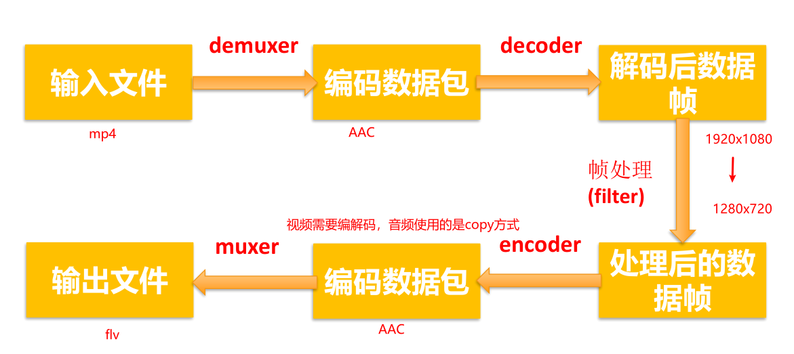

## ffmpeg基础

ffmpeg:音视频解码器

ffplay:媒体播放器

ffprobe:多媒体流分析器

### ffmpeg常看帮助文档命令

```
查看基本信息： ffmpeg -h    1
高级信息：ffmpeg -h long	2
所有信息：ffmpeg -h full	3

3包括2包括1

ffplay -h 
ffprobe -h
```

### ffmpeg音视频处理流程

```
ffmpeg -i test_1920x1080.mp4 -acodec copy -vcodec libx264 -s 1280x720 test_1280x720.flv


# -acodec copy 音频编码器采用的是copy方式
# -vcodec libx264 视频编码器采用的是x264
s 1280x720 对视频进行处理，转成1280x720分辨率
```



### ffmpeg命令分类查询

 

`-filters 加水印那些时候用`

查看具体分类所支持的参数
```
语法：ffmepg -h type=name

比如：ffmpeg -h muxer=flv
ffmpeg -h filter=atempo (atempo调整音频播放速率)
ffmpeg -h encoder=libx264
```
### ffplay播放控制


```
 ffplay -volume 10 mult.ts  # 设置初始音量为10
 然后可以用a切换音频流，
 用v切换视频流
 用c是切换整个节目，包括音频和视频
 ```

 ### ffplay命令

 ```
-x width 强制显示宽带。
-y height 强制显示高度。

ffplay -volume 10 -x 800 -y 600 test_1920x1080.mp4

 -video_size size 帧尺寸 设置显示帧存储(WxH格式)，仅适用于类似
原始YUV等没有包含帧大小(WxH)的视频。

 -pixel_format format 格式设置像素格式。

 比如: ffplay -pixel_format yuv420p -video_size 320x240 -framerate 5 yuv420p_320x240.yuv

 -fs 以全屏模式启动。
 -an 禁用音频（不播放声音）
 -vn 禁用视频（不播放视频）
 -sn 禁用字幕（不显示字幕）
 -ss pos 根据设置的秒进行定位拖动，注意时间单位：比如'55' 55
seconds, '12:03:45' ,12 hours, 03 minutes and 45 seconds, '23.189' 23.189
second

ffplay -volume 10 -x 800 -y 600 test_1920x1080.mp4 -ss 2:03:30
ffplay -volume 10 -x 800 -y 600 test_1920x1080.mp4 -ss 355s


 -t duration 设置播放视频/音频长度，时间单位如 -ss选项

ffplay -volume 10 -x 800 -y 600 test_1920x1080.mp4 -ss 355s -t 5
# 5秒后就暂停
 ```

 ```
◼ -bytes 按字节进行定位拖动（0=off 1=on -1=auto）。
◼ -seek_interval interval 自定义左/右键定位拖动间隔（以秒为单
位），默认值为10秒（代码没有看到实现）
◼ -nodisp 关闭图形化显示窗口，视频将不显示
◼ -noborder 无边框窗口
◼ -volume vol 设置起始音量。音量范围[0 ~100]
◼ -f fmt 强制使用设置的格式进行解析。主要针对pcm数据，比如-f s16le,
◼ -window_title title 设置窗口标题（默认为输入文件名）
◼ -loop number 设置播放循环次数
◼ -showmode mode 设置显示模式，可用的模式值： 0 显示视频，
1 显示音频波形，2 显示音频频谱。缺省为0，如果视频不存在则自动
选择2，通过w切换回来

ffplay test_1920x1080.mp4 -showmode 1 -x 600 -y 400 -ss 20


◼ -vf filtergraph 设置视频滤镜
◼ -af filtergraph 设置音频滤镜
 ```

 ### ffplay高级命令
 
```
◼ -stats 打印多个回放统计信息，包括显示流持续时间，编解码器参数，
流中的当前位置，以及音频/视频同步差值。默认情况下处于启用状
态，要显式禁用它则需要指定-nostats。。
◼ -fast 非标准化规范的多媒体兼容优化。
◼ -genpts 生成pts。
◼ -sync type 同步类型 将主时钟设置为audio（type=audio），video
（type=video）或external（type=ext），默认是audio为主时钟。
◼ -ast audio_stream_specifier 指定音频流索引，比如-ast 3，播放流索
引为3的音频流
◼ -vst video_stream_specifier指定视频流索引，比如-vst 4，播放流索引
为4的视频流
◼ -sst subtitle_stream_specifier 指定字幕流索引，比如-sst 5，播放流索
引为5的字幕流
◼ -autoexit 视频播放完毕后退出

ffplay -t 5 -autoexit mult.ts

```

```
◼ -exitonkeydown 键盘按下任何键退出播放
◼ -exitonmousedown 鼠标按下任何键退出播放
◼ -codec:media_specifier codec_name 强制使用设置的多媒体解码器，
media_specifier可用值为a（音频）， v（视频）和s字幕。比如-
codec:v h264_qsv 强制视频采用h264_qsv解码
◼ -acodec codec_name 强制使用设置的音频解码器进行音频解码
◼ -vcodec codec_name 强制使用设置的视频解码器进行视频解码
◼ -scodec codec_name 强制使用设置的字幕解码器进行字幕解码
◼ -autorotate 根据文件元数据自动旋转视频。值为0或1 ，默认为1。
◼ -framedrop 如果视频不同步则丢弃视频帧。当主时钟非视频时钟时
默认开启。若需禁用则使用 -noframedrop
◼ -infbuf 不限制输入缓冲区大小。尽可能快地从输入中读取尽可能多的数据。
播放实时流时默认启用，如果未及时读取数据，则可能会丢弃数据。此选项
将不限制缓冲区的大小。若需禁用则使用-noinfbuf
```

### ffplay播放命令

```

```


