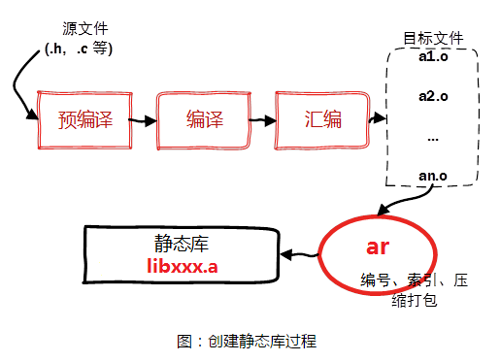
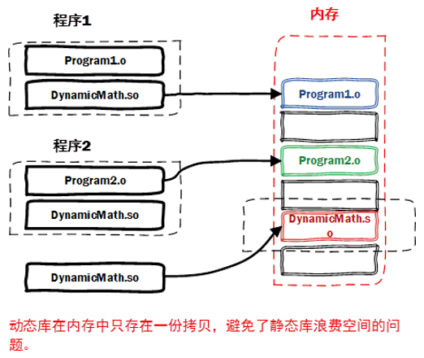
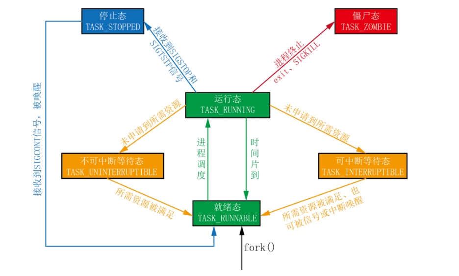
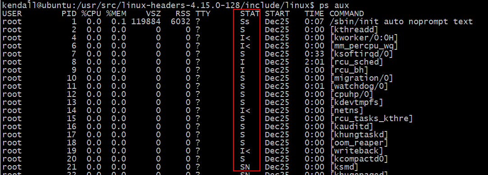

## 1.linux文件有哪几种权限，怎么授权？
### 1.1 修改文件的权限

linux是通过权限对文件进行控制的，可以通过使用`chmod`命令来修改文件相关的权限。

chmod修改权限有两种方式：
- 文字设定法

```
命令：chmod [who] [+|-|=] [mode] 文件名

操作对象【who】
u -- 用户（user）
g -- 同组用户（group）
o -- 其他用户（other）
a -- 所用用户（all）【默认】

操作符【+-=】
+ -- 添加权限
- -- 取消权限
= -- 赋予给定权限并取消其他权限

权限【mode】
r -- 读
w -- 写
x -- 执行
```
给文件file.txt的所有者和所属组添加读写权限:     
`chmod ug+wr file.txt`

- 数字设定法

```
命令：chmod [+|-|=][mode] 文件名

操作符【+-=】
+ -- 添加权限
- -- 取消权限
= -- 赋予给定权限并取消其他权限 (默认为=)

数字表示的含义
0 -- 没有权限(-)
1 -- 执行权限（x）
2 -- 写权限（w）
4 -- 读权限（r)

例：给file.txt文件设置 rw-rw-r--
chmod 664 file.txt
```

### 1.2 修改文件所有者和所属组
用户权限修改文件所有者`chown`

用法：`chown 文件所有者 文件名`
```
sudo chown mytest file.txt
```

修改文件所有者和所属组`chown`

用法：`chown 文件所有者:文件所属组 文件名`
```
sudo chown mytest:mytest file.txt
sudo chown mytest.mytest file.txt
```

> 注意:普通用户需要使用管理员执行该命令     
>注意: 若系统没有其他用户, 可以使用sudo adduser 用户名 创建一个新用户.

## 2.find和grep命令查找文件或者文件内容
```
# 按照文件名查找文件
find ./ -name "*.cpp" | grep "mian"

# xargs 查看文件里面的内容
find ./ -name "*llo" | xargs  grep -n -i "World"    # 加 -n 是显示行 加-i是不区分大小写
```

## 3.说说静态库和动态库
### 3.1 静态库
静态库可以认为是一些目标代码的集合, 是在可执行程序运行前就已经加入到执行码中, 成为执行程序的一部分. 按照习惯, 一般以.a做为文件后缀名.

静态库的命名一般分为三个部分：
- 前缀：lib
- 库名称：自定义即可, 如test
- 后缀：.a

所以最终的静态库的名字应该为：`libtest.a`

### 3.2静态库的制作
假如现在有`fun1.c` , `fun2.c`和`head.h`三个文件。其中head.h文件中有函数的声明,  fun1.c和fun2.c中有函数的实现.

下面以这三个文件为例介绍静态库的制作和使用

- 步骤1：将c源文件生成对应的.o文件
```
gcc -c fun1.c fun2.c
```

- 步骤2：使用打包工具ar将准备好的.o文件打包为.a文件 
> 在使用ar工具是时候需要添加参数rcs     
> r更新、c创建、s建立索引

```
ar rcs libtest1.a fun1.o fun2.o
```


### 3.2静态库的使用

静态库制作完成之后, 需要将`.a`文件和头文件一定发布给用户.
假设测试文件为`main.c`, 静态库文件为`libtest1.a`, 头文件为`head.h`

用到的参数：
- -L：指定要连接的库的所在目录
- -l：指定链接时需要的静态库, 去掉前缀和后缀
- -I: 指定`main.c`文件用到的头文件`head.h`所在的路径    
`gcc -o main1 main.c -L./ -ltest1 -I./`

### 3.3 共享库/动态库

共享库在程序编译的时候是不会被连接到目标代码中, 而是在程序运行是才被载入。 **不同的应用程序如果调用相同的库, 那么在内存里只需要有一份该共享库的拷贝, 规避了空间浪费问题。** 动态库在程序运行时才被载入, 也解决了静态库对程序的更新、部署和发布会带来麻烦. 用户只需要更新动态库即可, 增量更新。为什么需要动态库, 其实也是静态库的特点导致。
按照习惯, 一般以”.so”做为文件后缀名. 共享库的命名一般分为三个部分：
- 前缀：lib
- 库名称：自己定义即可, 如test
- 后缀：.so

所以最终的静态库的名字应该为：`libtest.so`



### 3.4 动态库的制作
- 1.生成目标文件`.o`, 此时要加编译选项：`-fPIC（fpic）`
```
gcc -fpic -c fun1.c fun2.c
```
参数：-fpic创建与地址无关的编译程序(pic, position independent code), 目的就是为了能够在多个应用程序间共享.

- 2.生成共享库, 此时要加链接器选项: `-shared`（指定生成动态链接库）
```
gcc -shared fun1.o fun2.o -o libtest2.so
```

### 3.5 动态库/共享库的使用
引用动态库编译成可执行文件（跟静态库方式一样）：
```
gcc main.c -I -L./ -ltest2 -o main2
```

用到的参数：
- -L：指定要连接的库的所在目录
- -l：指定链接时需要的动态库, 去掉前缀和后缀
- -I: 指定main.c文件用到的头文件`head.h`所在的路径

#### 遇到了什么问题？怎么解决？

在运行`./main2`，发现竟然报错了。


**为什么在执行的时候找不到libtest2.so库？**

当系统加载可执行代码时候, 能够知道其所依赖的库的名字, 但是还需要知道所依赖的库的绝对路径。此时就需要系统动态载入器(dynamic linker/loader)。

`ldd`命令可以查看可执行文件依赖的库文件, 执行`ldd main2`, 可以发现libtest2.so找不到.


**如何让系统找到共享库？**

- 第一种：拷贝自己制作的共享库到/lib或者/usr/lib
- 第二种：把`export LD_LIBRARY_PATH=$LD_LIBRARY_PATH:库路径`, 设置到`∼/.bashrc`文件中。
```
比如：设置成当前目录下的lib目录
export LD_LIBRARY_PATH=$LD_LIBRARY_PATH:./lib
```

### 3.6 静态库与动态库的比较

- 静态库的优点:
  
  * 1 执行速度快, 是因为静态库已经编译到可执行文件内部了
  * 2 移植方便, 不依赖域其他的库文件
- 缺点: 
    * 1 耗费内存, 是由于每一个静态库的可执行程序都会加载一次
    * 2 部署更新麻烦, 因为静态库修改以后所有的调用到这个静态库的可执行文件都需要重新编译
 
 - 动态库的优点:
    * 1 节省内存
    * 2 部署升级更新方便, 只需替换动态库即可, 然后再重启服务.
 - 缺点: 
    * 1 加载速度比静态库慢
    * 2 移植性差, 需要把所有用到的动态库都移植.

> 由于由静态库生成的可执行文件是把静态库加载到了其内部, 所以静态库生成的可执行文件一般会比动态库大.


## 4.gcc的工作流程


```
// 预处理  cpp预处理器，去掉注释，展开头文件，宏替换
gcc -E test.c -o test.i

// 编译 gcc,将源代码文件编译成汇编语言代码
gcc -S test.i -o test.s

// 汇编：as, 将汇编语言代码编译成了二进制文件(目标代码)
gcc -c test.s -o test.o

// 链接: ld, 链接test.c代码中调用的库函数
gcc test.o -o test
```

## 5.说一下makefile

makefile文件定义了一系列的规则来指定，哪些文件需要先编译，哪些文件需要后编译，哪些文件需要重新编译，甚至还能进行更复杂的功能操作。makefile带来的好处就是“**自动化编译**”，一旦写好只需要一个make命令就可以自动编译整个工程。

其中make是一个命令工具，是一个解释makefile中指令的命令工具。

**makefile使用的基本规则**

```
目标:依赖
（tab）命令
```
其中：
- 目标: 要生成的目标文件
- 依赖: 目标文件由哪些文件生成
- 命令: 通过执行该命令由依赖文件生成目标

例子：      
比如现在有`main.c fun1.c fun2.c sum.c`, 根据这个基本规则编写一个简单的makefile文件, 生成可执行文件`main`。
```makefile
# 会去下面找缺失的.o文件
main:main.o fun1.o fun2.o sum.o
	gcc -o main main.o fun1.o fun2.o sum.o

main.o:main.c
	gcc -o main.o -c main.c -I./

fun1.o:fun1.c
	gcc -o fun1.o -c fun1.c

fun2.o:fun2.c
	gcc -o fun2.o -c fun2.c

sum.o:sum.c
	gcc -o sum.o -c sum.c
```

**可以使用变量进行改进**
```makefile
target = main
object = main.o fun1.o fun2.o sum.o

CC = gcc
CPPFLAGS = -I./

$(target):$(object)
	$(CC) -o $@ $^

## 使用模式规则
%.o:%.c
	$(CC) -o $@ -c $< $(CPPFLAGS)

#main.o:main.c
#	$(CC)  -o main.o -c $< $(CPPFLAGS)
#
#fun1.o:fun1.c
#	$(CC)  -o fun1.o -c $<
#
#fun2.o:fun2.c
#	$(CC)  -o fun2.o -c $<
#
#sum.o:sum.c
#	$(CC)  -o sum.o -c sum.c
```
> 特别注意：自动变量只能在规则的命令中使用. 
   
``` 
自动变量：

$@: 表示规则中的目标     
$<: 表示规则中的第一个条件  //冒号后面出现的第一个条件    
$^: 表示规则中的所有条件, 组成一个列表, 以空格隔开, 如果这个列表中有重复的项则消除重复项。 
```
使用makefile函数和清理操作

```makefile
target = main
# 使用函数
src = $(wildcard *.c)  # 找到所有的.c文件
object = $(patsubst %.c, %.o , $(src))  # 把.c换成.o

CC = gcc
CPPFLAGS = -I./

$(target):$(object)
	$(CC) -o $@ $^

## 使用模式规则，匹配该目录下所有.o和。c结尾的文件
%.o:%.c
	$(CC) -o $@ -c $< $(CPPFLAGS)

# 清理操作
.PHONY:clean  #设置伪目标
clean:
	rm -f $(object) $(target)
```

### 5.1要生成静态库和动态库, Makefile怎么写？

- 生成静态库

```
# 使用函数
# 匹配当前目录下所有的.c文件  注意$()中不能添加空格
src = $(wildcard *.c)   
objs = $(patsubst %.c,%.o,$(src))   #将src的.c换成.o
# 普通变量
target = libtest1.a

# 制作静态库
#libtest1.a:add.o sub.o
#	ar rcs libtest1.a add.o sub.o
$(target):$(objs)
	# ar rcs $(target) $(objs)
	ar rcs $@ $^

# 汇编成.o文件
#add.o:add.c
#	gcc -c add.c -o add.o
#
#sub.o:sub.c
#	gcc -c sub.c -o sub.o

# $(objs):$(src)
%.o:%.c 
	gcc -c $<

# 清理操作
.PHONY:clean  #设置伪目标
clean:
	rm -f $(objs) $(target)
```

- 生成动态库

```
src = $(wildcard *.c)
objs = $(patsubst %.c,%.o,$(src));
target = libtest2.so

# 制作动态库  $@--> 自定义变量
$(target):$(objs)
	gcc -shared $^ -o $@ 
	mv $@ ./lib

%.o:%.c
	gcc -c -fpic $< -o $@

.PHONY:clean
clean:
	-rm -f $(target) $(objs)
```

## 6.堵塞与非堵塞的区别
- 堵塞是指调用结果返回之前，当线程会被挂起，函数只有在得到结果之后才会返回， *有人也许会把阻塞调用和同步调用等同起来，实际上它们是不同的。对于同步调用来说，很多时候当前线程还是激活的，只是从逻辑上当前函数没有返回而已。例如，我们在CSocket中调用Receive函数，如果缓冲区中没有数据，这个函数就会一直等待，直到有数据才返回。而此时，当前线程还会继续处理各种各样的消息。如果主窗口和调用函数在同一个线程中，除非你在特殊的界面操作函数中调用，其实主界面还是应该可以刷新。socket接收数据的另外一个函数recv则是一个阻塞调用的例子。当socket工作在阻塞模式的时候， 如果没有数据的情况下调用该函数，则当前线程就会被挂起，直到有数据为止。*

- 非阻塞：非阻塞和阻塞的概念相对应，指在不能立刻得到结果之前，该函数不会阻塞当前线程，而会立刻返回。

注意：
> 阻塞和非阻塞不是read函数的属性, 而是文件本身的属性.	
> 			
> 普通文件：默认是非堵塞的			
> 	
> 终端设备文件：默认是堵塞的		
> 		
> 管道和套接字：默认是堵塞的	

## 并发与并行的区别

- 并发就是在一段时间内，多个任务都会被处理；但在某一时刻，只有一个任务在执行。单核处理器可以做到并发。比如有两个进程A和B，A运行一个时间片之后，切换到B，B运行一个时间片之后又切换到A。因为切换速度足够快，所以宏观上表现为在一段时间内能同时运行多个程序。
> 如：若将CPU的1S的时间分成1000个时间片，每个进程执行完一个时间片必须无条件让出CPU的使用权，这样1S中就可以执行1000个进程。

- 并行就是在同一时刻，有多个任务在执行。这个需要多核处理器才能完成，在微观上就能同时执行多条指令，不同的程序被放到不同的处理器上运行，这个是物理上的多个进程同时进行。


## 进程的状态
进程状态反映进程执行过程的变化。这些状态随着进程的执行和外界条件的变化而转换。

在三态模型中，进程状态分为三个基本状态，即运行态，就绪态，阻塞态。

在五态模型中，进程分为新建态、终止态，运行态，就绪态，阻塞态。


- ①TASK_RUNNING（运行态）：进程正在被CPU执行。当一个进程刚被创建时会处于TASK_RUNNABLE，表示己经准备就绪，正等待被调度。

- ②TASK_INTERRUPTIBLE（可中断）：进程正在睡眠（也就是说它被阻塞）等待某些条件的达成。一旦这些条件达成，内核就会把进程状态设置为运行。处于此状态的进程也会因为接收到信号而提前被唤醒，比如给一个TASK_INTERRUPTIBLE状态的进程发送SIGKILL信号，这个进程将先被唤醒（进入TASK_RUNNABLE状态），然后再响应SIGKILL信号而退出（变为TASK_ZOMBIE状态），并不会从TASK_INTERRUPTIBLE状态直接退出。

- ③TASK_UNINTERRUPTIBLE（不可中断）：处于等待中的进程，待资源满足时被唤醒，但不可以由其它进程通过信号或中断唤醒。由于不接受外来的任何信号，因此无法用kill杀掉这些处于该状态的进程。而TASK_UNINTERRUPTIBLE状态存在的意义就在于，内核的某些处理流程是不能被打断的。如果响应异步信号，程序的执行流程中就会被插入一段用于处理异步信号的流程，于是原有的流程就被中断了，这可能使某些设备陷入不可控的状态。处于TASK_UNINTERRUPTIBLE状态一般总是非常短暂的，通过ps命令基本上不可能捕捉到。

- ④TASK_ZOMBIE（僵死）：表示进程已经结束了，但是其父进程还没有调用wait4或waitpid()来释放进程描述符。为了父进程能够获知它的消息，子进程的进程描述符仍然被保留着。一旦父进程调用了wait4()，进程描述符就会被释放。

- ⑤TASK_STOPPED（停止）：进程停止执行。当进程接收到SIGSTOP，SIGTSTP，SIGTTIN，SIGTTOU等信号的时候。此外，在调试期间接收到任何信号，都会使进程进入这种状态。当接收到SIGCONT信号，会重新回到TASK_RUNNABLE。



如何查看进程的状态？			

**通过`ps aux`查看进程的状态**




