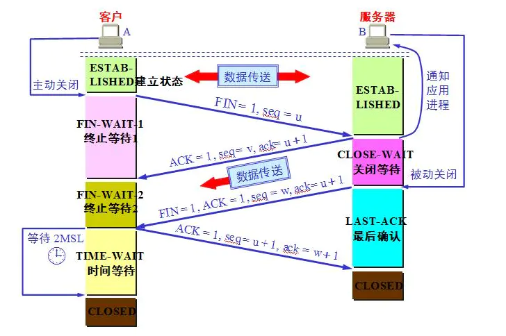

## 1.OSI与TCP/IP各层结构与功能

- OSI的分层(7层)：物理层、数据链路层、网络层、传输层、会话层、表示层、应用层
- TCP/IP(4层)：网络接口层、网际层、运输层、应用层
- 五层协议(5层)：物理层、数据链路层、网络层、运输层、应用层

每一层的作用：
- 物理层：负责数据的比特流如何在传输媒体上的传输（比特Bit）
- 数据链路层：数据链路层在不可靠的物理介质上提供可靠的传输。这一层的作用包括：物理寻址、数据成帧、流量控制、数据检错、重发等。 简单的说就是将比特组封装成帧和点到点的传递（帧Frame）
- 网络层：网络层负责对子网间的数据包进行路由选择。此外，网络层还可以实现拥塞控制、网际互连等功能。 （包PackeT）
- 传输层：提供端到端的报文传输，也就是主机到主机的层次。传输层负责将上层数据分段并提供端到端的、可靠的或不可靠的传输。此外，传输层还要处理端到端的差错控制和流量控制问题。(段Segment）
- 会话层：会话层管理主机之间的会话进程，也就是负责建立、管理、终止进程之间的会话。会话层还利用在数据中插入校验点来实现数据的同步。 (会话协议数据单元SPDU）
- 表示层：对数据进行翻译、加密和压缩（表示协议数据单元PPDU）
- 应用层 ：为操作系统或网络应用程序提供访问网络服务的接口。 （应用协议数据单元APDU）

## 2.TCP与UDP的区别

- 1.TCP面向连接，UDP无连接。
- 2.TCP面向字节流（文件传输），UDP是面向报文的，UDP没有拥塞控制，因此网络出现拥塞不会使源主机的发送速率降低（对IP电话，实时视频会议等）。
- 3.TCP首部开销20字节，UDP的首部开销小，只有8个字节。
- 4.TCP提供可靠的服务。也就是说，通过TCP连接传送的数据，无差错，不丢失，不重复，且有序到达; UDP只是尽最大努力交付，并不保证可靠交付。
- 5.每一条TCP连接只能是点到点的；UDP支持一对一，一对多，多对一和多对多的交互通信。
- 6.TCP的逻辑通信信道是全双工的可靠信道，UDP是不可靠信道。
- 7.TCP对系统资源的要求高于UDP，所以速度也比UDP慢。
- 8.TCP数据包是没有边界的，会出现粘包的问题，UDP包是独立的，不会出现粘包问题。
- 所以在应用方面，如果强调数据的完整性和正确性用TCP，当要求性能和速度的时候，使用UDP更加合适。

## 3.建立TCP服务器的各个系统调用

建立TCP服务器连接的过程中主要通过以下系统调用序列来获取某些函数，这些系统调用主要包括：socket（），bind（），listen（），accept（），send（）和recv（）。
详见：[建立TCP 服务器的系统调用](https://blog.csdn.net/qq_37964547/article/details/81429627)


## 3.TCP怎么保证可靠传输的

TCP保证可靠性：     
（1）序列号、确认应答、超时重传

数据到达接收方，接收方需要发出一个确认应答，表示已经收到该数据段，并且确认序号会说明了它下一次需要接收的数据序列号。如果发送发迟迟未收到确认应答，那么可能是发送的数据丢失，也可能是确认应答丢失，这时发送方在等待一定时间后会进行重传。这个时间一般是2`*`RTT(报文段往返时间）`+` 一个偏差值。

（2）窗口控制与高速重发控制/快速重传（重复确认应答）

TCP会利用窗口控制来提高传输速度，意思是在一个窗口大小内，不用一定要等到应答才能发送下一段数据，窗口大小就是无需等待确认而可以继续发送数据的最大值。如果不使用窗口控制，每一个没收到确认应答的数据都要重发。

使用窗口控制，如果数据段1001-2000丢失，后面数据每次传输，确认应答都会不停地发送序号为1001的应答，表示我要接收1001开始的数据，发送端如果收到3次相同应答，就会立刻进行重发；但还有种情况有可能是数据都收到了，但是有的应答丢失了，这种情况不会进行重发，因为发送端知道，如果是数据段丢失，接收端不会放过它的，会疯狂向它提醒......

（3）拥塞控制

如果把窗口定的很大，发送端连续发送大量的数据，可能会造成网络的拥堵（大家都在用网，你在这狂发，吞吐量就那么大，当然会堵），甚至造成网络的瘫痪。所以TCP在为了防止这种情况而进行了拥塞控制。

慢启动：定义拥塞窗口，一开始将该窗口大小设为1，之后每次收到确认应答（经过一个rtt），将拥塞窗口大小*2。

拥塞避免：设置慢启动阈值，一般开始都设为65536。拥塞避免是指当拥塞窗口大小达到这个阈值，拥塞窗口的值不再指数上升，而是加法增加（每次确认应答/每个rtt，拥塞窗口大小+1），以此来避免拥塞。

将报文段的超时重传看做拥塞，则一旦发生超时重传，我们需要先将阈值设为当前窗口大小的一半，并且将窗口大小设为初值1，然后重新进入慢启动过程。

快速重传：在遇到3次重复确认应答（高速重发控制）时，代表收到了3个报文段，但是这之前的1个段丢失了，便对它进行立即重传。

然后，先将阈值设为当前窗口大小的一半，然后将拥塞窗口大小设为慢启动阈值+3的大小。

这样可以达到：在TCP通信时，网络吞吐量呈现逐渐的上升，并且随着拥堵来降低吞吐量，再进入慢慢上升的过程，网络不会轻易的发生瘫痪。

## 4.TCP三次握手过程
TCP通信过程包括三个步骤：建立TCP连接通道，传输数据，断开TCP连接通道。如图1所示，给出了TCP通信过程的示意图。


上图主要包括三部分：**建立连接**、**传输数据**、**断开连接**。

建立TCP连接很简单，通过三次握手便可建立连接。
建立好连接后，开始传输数据。TCP数据传输牵涉到的概念很多：超时重传、快速重传、流量控制、拥塞控制等等。
断开连接的过程也很简单，通过四次握手完成断开连接的过程。

### 4.1 三次握手建立连接过程

- 第一次握手：客户端发送syn包(seq=x)到服务器，并进入SYN_SEND状态，等待服务器确认;
- 第二次握手：服务器收到syn包，必须确认客户的SYN(ack=x+1)，同时自己也发送一个SYN包(seq=y)，即SYN+ACK包，此时服务器进入SYN_RECV状态;
- 第三次握手：客户端收到服务器的SYN+ACK包，向服务器发送确认包`ACK(ack=y+1)`，此包发送完毕，客户端和服务器进入ESTABLISHED状态，完成三次握手。

握手过程中传送的包里不包含数据，三次握手完毕后，客户端与服务器才正式开始传送数据。理想状态下，TCP连接一旦建立，在通信双方中的任何一方主动关闭连接之前，TCP 连接都将被一直保持下去。

### 4.2 三次握手的原因

三次握手是为了防止，客户端的请求报文在网络滞留，客户端超时重传了请求报文，服务端建立连接，传输数据，释放连接之后，服务器又收到了客户端滞留的请求报文，建立连接一直等待客户端发送数据。

服务器对客户端的请求进行回应(第二次握手)后，就会理所当然的认为连接已建立，而如果客户端并没有收到服务器的回应呢？此时，客户端仍认为连接未建立，服务器会对已建立的连接保存必要的资源，如果大量的这种情况，服务器会崩溃。

## 5.四次挥手过程

- 第一次挥手：主动关闭方发送一个FIN，用来关闭主动方到被动关闭方的数据传送，也就是主动关闭方告诉被动关闭方：我已经不会再给你发数据了(当 然，在fin包之前发送出去的数据，如果没有收到对应的ack确认报文，主动关闭方依然会重发这些数据)，但此时主动关闭方还可以接受数据。

- 第二次挥手：被动关闭方收到FIN包后，发送一个ACK给对方，确认序号为收到序号+1(与SYN相同，一个FIN占用一个序号)。

- 第三次挥手：被动关闭方发送一个FIN，用来关闭被动关闭方到主动关闭方的数据传送，也就是告诉主动关闭方，我的数据也发送完了，不会再给你发数据了。

- 第四次挥手：主动关闭方收到FIN后，发送一个ACK给被动关闭方，确认序号为收到序号+1，至此，完成四次挥手。



### 5.1 为什么TCP协议终止链接要四次？

1、当客户端确认发送完数据且知道服务器已经接收完了，想要关闭发送数据口（当然确认信号还是可以发），就会发FIN给服务器。

2、服务器收到客户端发送的FIN，表示收到了，就会发送ACK回复。

3、但这时候服务器可能还在发送数据，没有想要关闭数据口的意思，所以服务器的FIN与ACK不是同时发送的，而是等到服务器数据发送完了，才会发送FIN给客户端。

4、客户端收到服务器发来的FIN，知道服务器的数据也发送完了，回复ACK， 客户端等待2MSL以后，没有收到服务器传来的任何消息，知道服务器已经收到自己的ACK了，客户端就关闭链接，服务器也关闭链接了。

### 5.2 为什么握手是三次，挥手是四次？

对于握手：握手只需要确认双方通信时的初始化序号，保证通信不会乱序。（第三次握手必要性：假设服务端的确认丢失，连接并未断开，客户机超时重发连接请求，这样服务器会对同一个客户机保持多个连接，造成资源浪费。）

对于挥手：TCP是双工的，所以发送方和接收方都需要FIN和ACK。只不过有一方是被动的，所以看上去就成了4次挥手。

## 6.DNS域名系统工作原理

1.查询 浏览器、操作系统 缓存。

2.请求 本地域名服务器

3.本地域名服务器未命中缓存，其请求 根域名服务器。

4.根域名服务器返回所查询域的主域名服务器。（主域名、顶级域名，如com、cn）

5.本地域名服务器请求主域名服务器，获取该域名的 名称服务器（域名注册商的服务器）。

6.本地域名服务器向 名称服务器 请求 域名-IP 映射。
7.缓存解析结果

> 详细了解DNS域名系统可[参考](https://blog.csdn.net/zhengqijun_/article/details/53811229)

## 7.ARP地址解析协议工作原理
首先，每台主机都会在自己的ARP缓冲区中建立一个 ARP列表，以表示IP地址和MAC地址的对应关系。当源主机需要将一个数据包要发送到目的主机时，会首先检查自己 ARP列表中是否存在该 IP地址对应的MAC地址，如果有，就直接将数据包发送到这个MAC地址；如果没有，就向本地网段发起一个ARP请求的广播包，查询此目的主机对应的MAC地址。此ARP请求数据包里包括源主机的IP地址、硬件地址、以及目的主机的IP地址。网络中所有的主机收到这个ARP请求后，会检查数据包中的目的IP是否和自己的IP地址一致。如果不相同就忽略此数据包；如果相同，该主机首先将发送端的MAC地址和IP地址添加到自己的ARP列表中，如果ARP表中已经存在该IP的信息，则将其覆盖，然后给源主机发送一个 ARP响应数据包，告诉对方自己是它需要查找的MAC地址；源主机收到这个ARP响应数据包后，将得到的目的主机的IP地址和MAC地址添加到自己的ARP列表中，并利用此信息开始数据的传输。如果源主机一直没有收到ARP响应数据包，表示ARP查询失败。

## 8.连续ARQ和滑动窗口协议

连续ARQ协议：所谓连续就是在发送完一个数据帧后，不是停下来等待确认帧，而是可以连续再发若干帧，边发可以边等待确认帧，如果收到了确认帧，又可以继续发送数据帧， 由于减少了等待的时间，利用率就提高了。
但是连续ARQ在收到一个否认帧或超时后，所有该帧后面的帧都要重发而不管该帧后面的帧是否正确传送 于是便有了选择重传ARQ协议。

滑动窗口协议：允许发送方发送多个分组而不需等待确认。（滑动窗口协议是TCP使用的一种流量控制方法，这个协议能够加速数据的传输）

---
## 9.说一下HTTP协议
HTTP协议工作在应用层，端口号是80。HTTP协议被用于网络中两台计算机间的通信，相比于TCP/IP这些底层协议，HTTP协议更像是高层标记型语言，浏览器根据从服务器得到的HTTP响应体中分别得到报文头，响应头和信息体（HTML正文等），之后将HTML文件解析并呈现在浏览器上。同样，我们在浏览器地址栏输入网址之后，浏览器相当于用户代理帮助我们组织好报文头，请求头和信息体（可选），之后通过网络发送到服务器，，服务器根据请求的内容准备数据。*所以如果想要完全弄明白HTTP协议，你需要写一个浏览器 + 一个Web服务器，一侧来生成请求信息，一侧生成响应信息。*

从网络分层模型来看，HTTP工作在应用层，其在传输层由TCP协议为其提供服务。所以可以猜到，HTTP请求前，客户机和服务器之间一定已经通过三次握手建立起连接，其中套接字中服务器一侧的端口号为HTTP周知端口80。在请求和传输数据时也是有讲究的，通常一个页面上不只有文本数据，有时会内嵌很多图片，这时候有两种选择可以考虑。一种是对每一个文件都建立一个TCP连接，传送完数据后立马断开，通过多次这样的操作获取引用的所有数据，但是这样一个页面的打开需要建立多次连接，效率会低很多。另一种是对于有多个资源的页面，传送完一个数据后不立即断开连接，在同一次连接下多次传输数据直至传完，但这种情况有可能会长时间占用服务器资源，降低吞吐率。

### 9.1 HTTP工作流程

一次完整的HTTP请求事务包含以下四个环节：

- 建立起客户机和服务器连接。
- 建立连接后，客户机发送一个请求给服务器。
- 服务器收到请求给予响应信息。
- 客户端浏览器将返回的内容解析并呈现，断开连接。
  
### 9.2 HTTP常见状态码
```
200 ：请求成功，成功返回网页
301 ：资源（网页等）被永久转移到其它URL
302 ：资源（网页等）被临时转移到其它URL
304 ：请求未修改、命中缓存
401 ：未授权
403 ：服务器拒绝请求
404 ：请求的网页或资源不存在
500 ：内部服务器错误，无法完成请求
502 ：错误网关
503 ：请求未完成，服务器临时过载或宕机
504 ：网关超时
```

> HTTP 深入介绍清[查看我的另一篇文章](/计算机网络/理解HTTP协议.md)
    
## 10.HTTP 和 HTTPS的区别
HTTP协议时超文本传输协议。

HTTPS是安全的超文本传输协议，是安全版的HTTP协议，使用安全套接字层(SSL)进行信息交换。

HTTPS协议主要针对解决HTTP协议以下不足：
- 1.通信使用明文（不加密），内容可能会被窃听
- 2.不验证通信方身份，应此可能遭遇伪装
- 3.无法证明报文的完整性（即准确性），所以可能已遭篡改      

> HTTP+加密+认证+完整性保护=HTTPS

HTTP端口 80,HTTPS端口443

HTTPS采用对称加密、
SSL位于应用层于传输层TCP之间，原本数据由应用层直接交由传输层处理，现在会经过SSL加密再进行传输。

HTTPS也不是绝对安全的，针对SSL的中间人攻击方式主要有两类，分别是SSL劫持攻击和SSL剥离攻击。

SSL劫持攻击就是 SSL证书欺骗攻击，将自己接入到客户端和目标网站之间； 在传输过程中伪造服务器的证书，将服务器的公钥替换成自己的公钥。

## 11.请你来说一下GET和POST的区别
**1、概括**

- 对于GET方式的请求，浏览器会把http header和data一并发送出去，服务器响应200（返回数据）；

- 而对于POST，浏览器先发送header，服务器响应100 continue，浏览器再发送data，服务器响应200 ok（返回数据）

**2、区别：**

- 1、get参数通过url传递，post放在request body中。
- 2、get请求在url中传递的参数是有长度限制的，而post没有。
- 3、get比post更不安全，因为参数直接暴露在url中，所以不能用来传递敏感信息。
- 4、get请求只能进行url编码，而post支持多种编码方式。
- 5、get请求会浏览器主动cache，而post支持多种编码方式。
- 6、get请求参数会被完整保留在浏览历史记录里，而post中的参数不会被保留。
- 7、GET和POST本质上就是TCP链接，并无差别。但是由于HTTP的规定和浏览器/服务器的限制，导致他们在应用过程中体现出一些不同。

- 8、GET产生一个TCP数据包；POST产生两个TCP数据包。

## 12.请你来说一下数字证书是什么，里面都包含那些内容
1**）概念**：

数字证书是数字证书在一个身份和该身份的持有者所拥有的公/私钥对之间建立了一种联系，由认证中心（CA）或者认证中心的下级认证中心颁发的。根证书是认证中心与用户建立信任关系的基础。在用户使用数字证书之前必须首先下载和安装。

认证中心是一家能向用户签发数字证书以确认用户身份的管理机构。为了防止数字凭证的伪造，认证中心的公共密钥必须是可靠的，认证中心必须公布其公共密钥或由更高级别的认证中心提供一个电子凭证来证明其公共密钥的有效性，后一种方法导致了多级别认证中心的出现。

**2）数字证书颁发过程：**

数字证书颁发过程如下：用户产生了自己的密钥对，并将公共密钥及部分个人身份信息传送给一家认证中心。认证中心在核实身份后，将执行一些必要的步骤，以确信请求确实由用户发送而来，然后，认证中心将发给用户一个数字证书，该证书内附了用户和他的密钥等信息，同时还附有对认证中心公共密钥加以确认的数字证书。当用户想证明其公开密钥的合法性时，就可以提供这一数字证书。

**3）内容：**

数字证书的格式普遍采用的是X.509V3国际标准，一个标准的X.509数字证书包含以下一些内容：

- 1、证书的版本信息；
- 2、证书的序列号，每个证书都有一个唯一的证书序列号；
- 3、证书所使用的签名算法；
- 4、证书的发行机构名称，命名规则一般采用X.500格式；
- 5、证书的有效期，通用的证书一般采用UTC时间格式；
- 6、证书所有人的名称，命名规则一般采用X.500格式；
- 7、证书所有人的公开密钥；
- 8、证书发行者对证书的签名。

## 13.请你说一下阻塞，非阻塞，同步，异步
- 阻塞和非阻塞：调用者在事件没有发生的时候，一直在等待事件发生，不能去处理别的任务这是阻塞。调用者在事件没有发生的时候，可以去处理别的任务这是非阻塞。
- 同步和异步：调用者必须循环自去查看事件有没有发生，这种情况是同步。调用者不用自己去查看事件有没有发生，而是等待着注册在事件上的回调函数通知自己，这种情况是异

## 14. HTTPS请求的过程

- 1) 客户端向服务器发起HTTPS请求，连接到服务器的443端口；
- 2) 服务器端有一个密钥对，即公钥（即数字证书）和私钥，是用来进行非对称加密使用的，服务器端保存着私钥，不能将其泄露，公钥可以发送给任何人；
- 3) 服务器将自己的公钥发送给客户端；
- 4) 客户端收到服务器端的公钥之后，检查其合法性，如果发现发现公钥有问题，那么HTTPS传输就无法继续，如果公钥合格，则客户端会生成一个客户端密钥，然后用服务器的公钥对客户端密钥进行非对称加密成密文，至此，HTTPS中的第一次HTTP请求结束；
- 5) 客户端发起HTTPS中的第二个HTTP请求，将加密之后的客户端密钥发送给服务器；
- 6) 服务器接收到客户端发来的密文之后，会用自己的私钥对其进行非对称解密，解密之后的明文就是客户端密钥，然后用客户端密钥对数据进行对称加密，这样数据就变成了密文；
- 7) 然后服务器将加密后的密文发送给客户端；
- 8) 客户端收到服务器发送来的密文，用客户端密钥对其进行对称解密，得到服务器发送的数据。这样HTTPS中的第二个HTTP请求结束，整个HTTPS传输完成。

## 15.浏览器输入`url`发生了什么事

1. 首先是域名解析，客户端使用DNS协议将URL解析为对应的IP地址；

2. 然后建立TCP连接，客户端与服务器通过三次握手建立TCP连接；
   
3. 接着是http连接，客户端向服务器发送http连接请求； （http连接无需额外连接，直接通过已经建立的TCP连接发送）
   
4. 服务器对客户端发来的http请求进行处理，并返回响应；
   
5. 客户端接收到http响应，将结果渲染展示给用户。