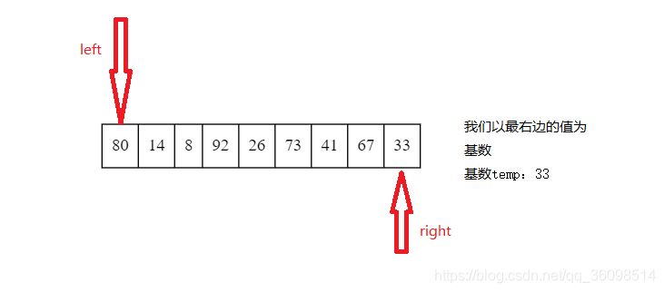
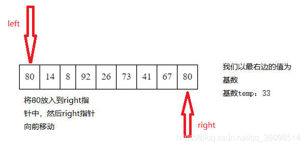
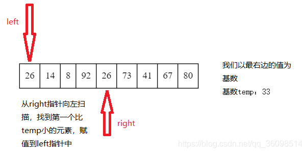

## 常见的排序算法

### 快速排序

思想：给要排序的数组设置一个基准数据，加入说是把最右边的数据设为基准数据，然后根据这个数据从左向右进行比较，



- 1.从左向右找，比较left指针的元素是否大于temp这个基准数据,如果大于，则将该值赋值到`right`指针中,然后将`right--`



- 2.然后从`right`指针开始遍历找到第一个比`temp`小的元素，赋值到`right`中，然后`left++`



- 3.然后再从`left`指针开始向右遍历第一个比temp大的，再赋值到`right`元素，反复这种操作，直到`left`和`right`指针重合,将`temp`值放入其中。

- 4.其中少了一步92赋值的步骤，思路大致如此

这样我们就可以利用temp分成左右两组，左边的值一定小于 或等于`temp`，右边的值一定大于或等于`temp`

然后再将左右两组数据按照`1，2，3`的步骤执行，直到左右数组长度小于`2`的时候，也就是一开始`left`和`right`指针就相同的情况，结束循环。

```cpp
//从小到大
void quick_sort(vector<int> &arr,int start,int end){
    //如果数组为空直接返回
    // if(start + 1 >= end) return ;
    //设置基准
    int left = start,right = end;
    int temp = arr[right];
    while(left < right)
    {
        //从左向右
        while(left < right && arr[left] <= temp)
        {
            ++left;
        }
        
        arr[right] = arr[left];
        //从右向左
        while(left < right && arr[right] >= temp)
        {
            --right;
        }
        arr[left] = arr[right];
    }
    //遍历一遍完,这时候left=right
    arr[right] = temp;
    //将数组分成两部分，左边全部比temp小，右边全部比temp大
    if(left!=start)  //还在开始部分说明就只有右边
        quick_sort(arr,start,left - 1); //这里如果不 -1 ，前面right = end就要-1
    if(right != end) //还在结束位置说明只有左边
    quick_sort(arr,left + 1,end);
}
```
### 归并排序

思想：归并排序采用的是分治法思想，
- 首相是将 `n` 个元素分治成 `n/2` 个元素的子序列
- 用合并排序算法对两个子序列进行排序
- 合并两个已经排序好的子序列
- 递归以上的三个步骤，直到全部排好序

动图演示：


```cpp
#include <iostream>
#include <vector>
using namespace std;

//合并
void merge(vector<int> &nums,vector<int> &temp,int left,int mid,int right){
    //标记左半区域第一个未排序元素
    int l_post = left;
    //标记右半区域第一个未排序元素
    int r_pos = mid + 1;
    //标记临时数据的位置
    int pos = left;

    while(l_post <= mid && r_pos <= right){
        //如果左边的未排序元素更小就将其放在临时数组中
        if(nums[l_post] < nums[r_pos])
            temp[pos++] = (nums[l_post++]);
        //如果右边的未排序元素更小就将其放在临时数组中
        if(nums[l_post] > nums[r_pos])
            temp[pos++] = nums[r_pos++];
        //如果有一遍已经没有元素了，直接将另一边放置最后
    }
    while(l_post <= mid)
    {
        temp[pos++] = nums[l_post++];
    }
    while (r_pos <= right)
    {
        temp[pos++] = nums[r_pos++];
    }
    //最后将临时数组复制回原来的数组中
    while (left <= right)
    {
        nums[left] = temp[left];
        ++left;
    }


}
//归并排序
void msort(vector<int> &nums, vector<int> &temp, int left,int right){
    //如果只有一个元素那么就不需要继续分配
    //因为只有一个元素的区域本身就是有序，只需要合并即可
    if(left < right) {
        //找中间点
        int mid = (left + right) / 2;
        //递归划分左半区
        msort(nums,temp,left,mid);
        //递归划分右半区
        msort(nums,temp,mid + 1,right);
        //合并已排序的部分
        merge(nums,temp,left,mid,right);
    }
}
//归并排序入口
void merge_sort(vector<int> &nums, int left,int right)
{
    //分配一个辅助数组
    vector<int> temp(nums.size());
    //进入归并排序
    msort( nums, temp, left, right-1);
}

int main()
{
    vector<int> arr = {2,3,5,1,8,4,6,7,9,0,10,11,13,12,15,14};
    for(int i =0;i<arr.size();++i){
        cout << arr[i] << " ";
    }
    cout << endl;
    //经过归并排序后
    merge_sort(arr,0,arr.size());
    for(int i =0;i<arr.size();++i){
        cout << arr[i] << " ";
    }
    cout << endl;
    return 0;
}
```

### 插入排序

```cpp
void insertion_sort(vector<int> &nums, int n) {
    for (int i = 0; i < n; ++i) {
        for (int j = i; j > 0 && nums[j] < nums[j-1]; --j) {
           swap(nums[j], nums[j-1]);
		} 
	}
}
```

### 冒泡排序

```cpp
void bubble_sort(vector<int> &nums, int n) {
    bool swapped;
    for (int i = 1; i < n; ++i) {
		swapped = false;
		for (int j = 1; j < n - i + 1; ++j) {
			if (nums[j] < nums[j-1]) {
				swap(nums[j], nums[j-1]);
				swapped = true;
			} 
		}
		if (!swapped) {
			break;
		} 
	}
}
```

### 选择排序

```cpp
void selection_sort(vector<int> &nums, int n) {
    int mid;
    for (int i = 0; i < n - 1; ++i) {
    	mid = i;
		for (int j = i + 1; j < n; ++j) {
			if (nums[j] < nums[mid]) {
				mid = j; 
			}
		}
    	swap(nums[mid], nums[i]);
    }
}
```

测试：

```cpp
int main() 
{
	vector<int> nums = {1,3,5,7,2,6,4,8,9,2,8,7,6,0,3,5,9,4,1,0};

	//调用自己实现的排序函数
	quick_sort(nums,0,nums.size());
    //归并排序忽略
	insertion_sort(nums, nums.size());
	bubble_sort(nums, nums.size());
    selection_sort(nums, nums.size());
	for(int i=0;i<nums.size();++i)
	{
		cout << nums[i] << ' ';
	}
	cout << endl;
    return  0;

}
```
-----------------
>>>>> leetcode hot 100

## 1. 56-合并区间
[题目来源](https://leetcode-cn.com/problems/merge-intervals/)

以数组 intervals 表示若干个区间的集合，其中单个区间为 intervals[i] = [starti, endi] 。请你合并所有重叠的区间，并返回一个不重叠的区间数组，该数组需恰好覆盖输入中的所有区间。

示例：

```
输入：intervals = [[1,3],[2,6],[8,10],[15,18]]
输出：[[1,6],[8,10],[15,18]]
解释：区间 [1,3] 和 [2,6] 重叠, 将它们合并为 [1,6].

输入：intervals = [[1,4],[4,5]]
输出：[[1,5]]
解释：区间 [1,4] 和 [4,5] 可被视为重叠区间。
```

思想：按照每个集合的左边进行排序。找出有交集的集合的最大值和最小值加入`ret`中.

```cpp
class Solution {
public:
    vector<vector<int>> merge(vector<vector<int>>& intervals) {
         vector<vector<int>> ret;
        int len = intervals.size();
        if(len == 0) return intervals;
        sort(intervals.begin(),intervals.end());

        // 第一个数的最大中和最小值
        int maxn = intervals[0][1],minn = intervals[0][1];
        for(int i=0;i<len;++i){
            //如果存在交集
            if(intervals[i][0] <= maxn && intervals[i][1] >= minn){
                maxn = max(maxn,intervals[i][1]);
                minn = min(minn,intervals[i][0]);
            }
            else{ //如果不存在交集就直接加入到输出队列中
                ret.push_back({minn,maxn});
                // 然后将maxn设置为这个数组的最大值,minn设置为这个数组的最小值
                maxn = intervals[i][1];
                minn = intervals[i][0];
            }
        }
        //把最后一组加入队列中
        ret.push_back({minn,maxn});
        return ret;
    }
};
```
## 2.75-颜色分类

[题目来源](https://leetcode-cn.com/problems/sort-colors/)

给定一个包含红色、白色和蓝色，一共 n 个元素的数组，原地对它们进行排序，使得相同颜色的元素相邻，并按照红色、白色、蓝色顺序排列。

此题中，我们使用整数 0、 1 和 2 分别表示红色、白色和蓝色。

示例：

```
输入：nums = [2,0,2,1,1,0]
输出：[0,0,1,1,2,2]

输入：nums = [2,0,1]
输出：[0,1,2]

输入：nums = [0]
输出：[0]
```

思路：做对这道题需要熟悉快速排序的 partition 过程。

**什么是 partition**？

在快速排序算法中，我们需要选择一个标定元素（基准，称为 pivot ，一般而言随机选择），然后通过一次扫描，将数组分成三部分
- 第 1 部分严格小于 pivot 元素的值；
- 第 2 部分恰好等于 pivot 元素的值；
- 第 3 部分严格大于 pivot 元素的值。

第 2 部分元素就是排好序以后它们应该在的位置，接下来只需要递归处理第 1 部分和第 3 部分的元素。

经过一次扫描把整个数组分成 3 个部分，正好符合当前问题的场景。写对这道题的方法是：把循环不变量的定义作为注释写出来，然后再编码。

```cpp
class Solution {
public:
    void sortColors(vector<int> &nums) {
        int size = nums.size();
        if (size < 2) {
            return;
        }

        int zero = 0;
        int two = size;
        int i = 0;
        while (i < two) {
            if (nums[i] == 0) {
                swap(nums[zero], nums[i]);
                zero++;
                i++;
            } else if (nums[i] == 1) {
                i++;
            } else {
                two--;
                swap(nums[i], nums[two]);
            }
        }
    }
};
```

## 3.148-排序链表

[题目来源](https://leetcode-cn.com/problems/sort-list/)

给你链表的头结点 head ，请将其按 升序 排列并返回 排序后的链表 。

进阶：

你可以在 O(n log n) 时间复杂度和常数级空间复杂度下，对链表进行排序吗？
 

示例：


```
输入：head = [4,2,1,3]
输出：[1,2,3,4]

输入：head = []
输出：[]
```

题解：

这道题只能用归并排序才能符合要求。归并排序需要的 2 个操作在其他题目已经出现过了，取中间点是 第 876 题，合并 2 个有序链表是第 21 题。


---------
## 1.剑指offer-最小的k个数

[题目来源](https://leetcode-cn.com/problems/zui-xiao-de-kge-shu-lcof/)

输入整数数组 arr ，找出其中最小的 k 个数。例如，输入4、5、1、6、2、7、3、8这8个数字，则最小的4个数字是1、2、3、4。

示例：

```
输入：arr = [3,2,1], k = 2
输出：[1,2] 或者 [2,1]
```

题解：      
先排序后取出前k个数

```cpp
class Solution {
public:
    vector<int> getLeastNumbers(vector<int>& arr, int k) {
        if(arr.size() == 0 || arr.size() <= k) 
        {
            return arr;
        }
        vector<int> res;
        sort(arr.begin(),arr.end());
        for(int i=0;i<k;++i) {
            res.push_back(arr[i]);
        }
        return res;
    }
};
```

----------

## 2.215数组中的第K个最大元素

[题目来源](https://leetcode-cn.com/problems/kth-largest-element-in-an-array/)

在未排序的数组中找到第 k 个最大的元素。请注意，你需要找的是数组排序后的第 k 个最大的元素，而不是第 k 个不同的元素。

示例：

```
输入: [3,2,1,5,6,4] 和 k = 2
输出: 5
```

题解：

方法一：排序后取出第K大个元素（面试时建议提一下就好）

```cpp
class Solution {
public:
    int findKthLargest(vector<int>& nums, int k) {
        
        sort(nums.begin(),nums.end(),[](int x,int y){
            return x > y;
        });
        return nums[k-1];
    }
};
```

方法二：

小顶堆实现实现：

```cpp
// Min heap, O(NlgK)
class Solution3 {
public:
    int findKthLargest(vector<int>& nums, int k) {
        priority_queue<int, vector<int>, greater<int>> pq;
        for (int i = 0; i < nums.size(); i++) {
            pq.push(nums[i]);
            if (pq.size() > k) {
                pq.pop();
            }
        }

        return pq.top();
    }
};
```

方法三：大顶堆实现

```cpp
class Solution2 {
public:
    int findKthLargest(vector<int>& nums, int k) {
        priority_queue<int> pq;
        for (int i = 0; i < nums.size(); i++) {
            pq.push(nums[i]);
        }

        for (int i = 0; i < k - 1; i++) {
            pq.pop();
        }

        return pq.top();
    }
};
```

方法三：大顶堆

```cpp
class Solution {
public:
    int findKthLargest(vector<int>& nums, int k) {
        priority_queue<int> pq;
        for(int i=0;i<nums.size();++i)
        {
            pq.push(nums[i]);
        }
        //从大顶堆中删除k-1个元素
        for(int i=0;i<k-1;++i){
            pq.pop();
        }
        return pq.top();
    }
};
```

## 3.347前 K 个高频元素

[题目来源](https://leetcode-cn.com/problems/top-k-frequent-elements/)

给定一个非空的整数数组，返回其中出现频率前 k 高的元素。

示例
```
输入: nums = [1,1,1,2,2,3], k = 2
输出: [1,2]

输入: nums = [1], k = 1
输出: [1]
```

题解：桶排序

顾名思义，桶排序的意思是为每个值设立一个桶，桶内记录这个值出现的次数(或其它属
性)，然后对桶进行排序。针对样例来说，我们先通过桶排序得到三个桶 [1,2,3,4]，它们的值分别 为 [4,2,1,1]，表示每个数字出现的次数。      
紧接着，我们对桶的频次进行排序，前 k 大个桶即是前 k 个频繁的数。这里我们可以使用各种 排序算法，甚至可以再进行一次桶排序，把每个旧桶根据频次放在不同的新桶内。针对样例来说， 因为目前最大的频次是 4，我们建立 [1,2,3,4] 四个新桶，它们分别放入的旧桶为 [[3,4],[2],[],[1]]， 表示不同数字出现的频率。最后，我们从后往前遍历，直到找到 k 个旧桶。

```cpp
class Solution {
public:
    vector<int> topKFrequent(vector<int>& nums, int k) {
        unordered_map<int, int> num_freq;//以每个数字为key，存该数字出现的次数
        int max_freq = 0;
        for(int num : nums){
            num_freq[num] ++;
            if(num_freq[num] > max_freq)
                max_freq = num_freq[num];
        }
        vector<stack<int>> bucket(max_freq+1, stack<int>());//桶的下标是频次，内容是同频次的数字。下标为0的桶为空。
        for(auto& it : num_freq){
            bucket[it.second].push(it.first);
        }
        vector<int> topK;//存答案
        int freq = max_freq;
        while(freq > 0 && topK.size() < k){//控制topK中只存k个
            while(!bucket[freq].empty() && topK.size() < k){//控制topK中只存k个
                topK.push_back(bucket[freq].top());
                bucket[freq].pop();
            }
            freq--;
        }
        return topK;
    }
};

```

## 4. 451根据字符出现频率排序
[题目来源](https://leetcode-cn.com/problems/sort-characters-by-frequency/)

解题思路
- 1.申请一个辅助队列来记录字符出现的频率
- 2.申请一个数组模拟哈希记录每个字符出现的次数
- 3.队列元素依次出列，去模拟哈希数组里面找到出现对于次数的字符
- 4.追加字符到str
- 5.结束当前循环，当前字符位置设置为0。


```cpp
class Solution {
public:
    string frequencySort(string s) {

        string str;
        vector<int>hash(128,0);
        int j;
        priority_queue<int,vector<int>,less<int>>que;
        for(int i=0;i<s.size();i++)
        {
            hash[s[i]]++;
        }
        for(int i=0;i<hash.size();i++)
        {
            if(hash[i])
            {
                que.push(hash[i]);
            }
        }
        while(!que.empty())
        {
            int res=que.top();
            for( j=0;j<hash.size();j++)
            {
                if(hash[j]==res)
                {
                   for(int k=0;k<res;k++)
                   {
                       str+=(char)j;
                   }
                   break;
                }
            }
            hash[j]=0;
            que.pop();
        }
        return str;
    }
};
```
