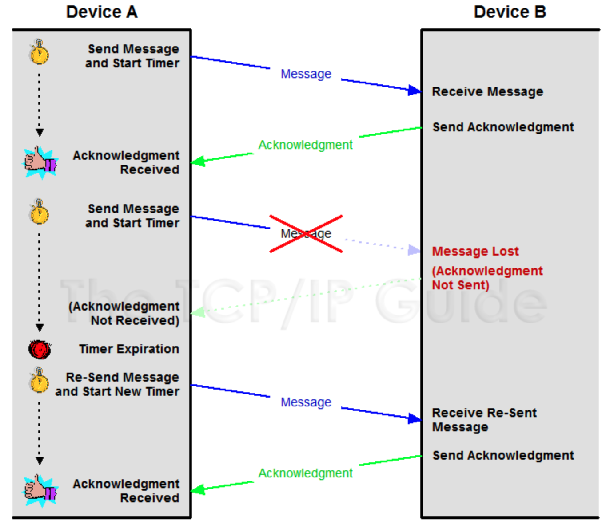
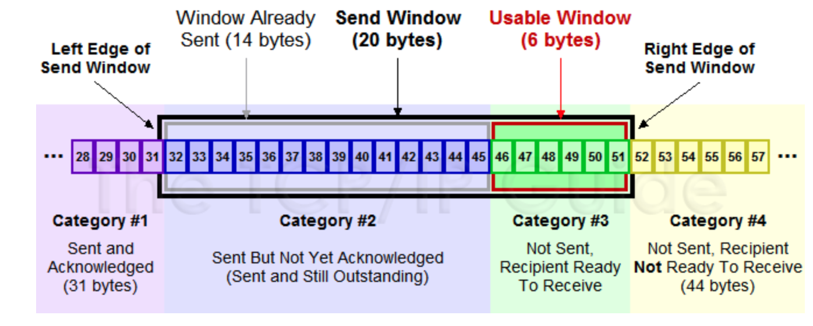

## 1.TCP的优势

从传输数据来讲，`TCP/UDP`以及其他协议都可以完成数据的传输，从一端传输到另外一端，`TCP`比较出众的一点就是提供一个**可靠的**，**流控制**的数据传输，所以实现起来要比其他协议复杂的多，

 1. 可靠性 ，提供`TCP`的可靠性，`TCP`的传输要保证数据能够准确到达目的地，如果不能，需要能检测出来并且重新发送数据。

 2. 流控制，提供`TCP`的流控特性，管理发送数据的速率，不要超过设备的承载能力。

为了能够实现以上2点，·实现了很多细节的功能来保证数据传输，比如说 滑动窗口适应系统，超时重传机制，累计`ACK`等，这次先介绍一下滑动窗口的一些知识点。

## 2.滑动窗口引入

IP层协议属于不可靠的协议，`IP`层并不关系数据是否发送到了对端，`TCP`通过确认机制来保证数据传输的可靠性，在比较早的时候使用的是$send--wait--send$的模式，其实这种模式叫做$stop-wait$模式，发送数据方在发送数据之后会启动定时器，但是如果数据或者`ACK`丢失，那么定时器到期之后，收不到`ACK`就认为发送出现状况，要进行重传。这样就会降低了通信的效率，如下图所示，这种方式被称为 `positive acknowledgment with retransmission (PAR)`

## 3.滑动窗口

可以假设一下，来优化一下`PAR`效率低的缺点，比如我让发送的每一个包都有一个`id`，接收端必须对每一个包进行确认，这样设备A一次多发送几个片段，而不必等候`ACK`，同时接收端也要告知它能够收多少，这样发送端发起来也有个限制，当然还需要保证顺序性，不要乱序，对于乱序的状况，我们可以允许等待一定情况下的乱序，比如说先缓存提前到的数据，然后去等待需要的数据，如果一定时间没来就`DROP`掉，来保证顺序性！

在`TCP/IP`协议栈中，滑动窗口的引入可以解决此问题，先来看从概念上数据分为哪些类

1. Sent and Acknowledged：这些数据表示已经发送成功并已经被确认的数据，比如图中的前`31`个`bytes`，这些数据其实的位置是在窗口之外了，因为窗口内顺序最低的被确认之后，要移除窗口，实际上是窗口进行合拢，同时打开接收新的带发送的数据

2. Send But Not Yet Acknowledged：这部分数据称为发送但没有被确认，数据被发送出去，没有收到接收端的ACK，认为并没有完成发送，这个属于窗口内的数据。

3. Not Sent，Recipient Ready to Receive：这部分是尽快发送的数据，这部分数据已经被加载到缓存中，也就是窗口中了，等待发送，其实这个窗口是完全有接收方告知的，接收方告知还是能够接受这些包，所以发送方需要尽快的发送这些包

4. Not Sent，Recipient Not Ready to Receive： 这些数据属于未发送，同时接收端也不允许发送的，因为这些数据已经超出了发送端所接收的范围

对于接收端也是有一个接收窗口的，类似发送端，接收端的数据有`3`个分类，因为接收端并不需要等待`ACK`所以它没有类似的接收并确认了的分类，情况如下

1.  Received and ACK Not Send to Process：这部分数据属于接收了数据但是还没有被上层的应用程序接收，也是被缓存在窗口内

2.  Received  Not ACK: 已经接收并，但是还没有回复`ACK`，这些包可能输属于`Delay ACK`的范畴了

3.  Not Received：有空位，还没有被接收的数据。

**发送窗口和可用窗口**

对于发送方来讲，窗口内的包括两部分，就是发送窗口（已经发送了，但是没有收到`ACK`），可用窗口，接收端允许发送但是没有发送的那部分称为可用窗口。

1. Send Window ： `20`个`bytes` 这部分值是有接收方在三次握手的时候进行通告的，同时在接收过程中也不断的通告可以发送的窗口大小，来进行适应

2. Window Already Sent: 已经发送的数据，但是并没有收到ACK。
   

## 4.滑动窗口原理

`TCP`并不是每一个报文段都会回复`ACK`的，可能会对两个报文段发送一个`ACK`，也可能会对多个报文段发送`1`个`ACK`【累计`ACK`】，比如说发送方有`1/2/3`,`3`个报文段，先发送了`2,3` 两个报文段，但是接收方期望收到`1`报文段，这个时候`2`,`3`报文段就只能放在缓存中等待报文1的空洞被填上，如果报文`1`，一直不来，报文`2/3`也将被丢弃，如果报文`1`来了，那么会发送一个`ACK`对这`3`个报文进行一次确认。

举一个例子来说明一下滑动窗口的原理：

1. 假设`32~45` 这些数据，是上层`Application`发送给`TCP`的，`TCP`将其分成四个`Segment`来发往`internet`

2. `seg1 32~34 seg3 35~36 seg3 37~41 seg4 42~45`  这四个片段，依次发送出去，此时假设接收端之接收到了`seg1 seg2 seg4`

3. 此时接收端的行为是回复一个`ACK`包说明已经接收到了32~36的数据，并将`seg4`进行缓存（保证顺序，产生一个保存`seg3 `的`hole`）

4. 发送端收到`ACK`之后，就会将`32~36`的数据包从发送并没有确认切到发送已经确认，提出窗口，这个时候窗口向右移动

5. 假设接收端通告的`Window Size`仍然不变，此时窗口右移，产生一些新的空位，这些是接收端允许发送的范畴

6. 对于丢失的`seg3`，如果超过一定时间，`TCP`就会重新传送（重传机制），重传成功会`seg3 seg4`一块被确认，不成功，`seg4`也将被丢弃

就是不断重复着上述的过程，随着窗口不断滑动，将真个数据流发送到接收端，实际上接收端的`Window Size`通告也是会变化的，接收端根据这个值来确定何时及发送多少数据，从对数据流进行流控。原理图如下图所示：

## 5.滑动窗口动态调整

主要是根据接收端的接收情况，动态去调整`Window Size`，然后来控制发送端的数据流量

客户端不断快速发送数据，服务器接收相对较慢，看下实验的结果

- a. 包`175`，发送`ACK`携带`WIN = 384`，告知客户端，现在只能接收384个字节

- b. 包`176`，客户端果真只发送了`384`个字节，`Wireshark`也比较智能，也宣告`TCP Window Full`

- c. 包`177`，服务器回复一个`ACK`，并通告窗口为`0`，说明接收方已经收到所有数据，并保存到缓冲区，但是这个时候应用程序并没有接收这些数据，导致缓冲区没有更多的空间，故通告窗口为`0`, 这也就是所谓的零窗口，零窗口期间，发送方停止发送数据

- d. 客户端察觉到窗口为`0`，则不再发送数据给接收方

- e. 包`178`，接收方发送一个窗口通告，告知发送方已经有接收数据的能力了，可以发送数据包了

- f.包`179`，收到窗口通告之后，就发送缓冲区内的数据了.

总结一点，就是接收端可以根据自己的状况通告窗口大小，从而控制发送端的发送，进行流量控制
