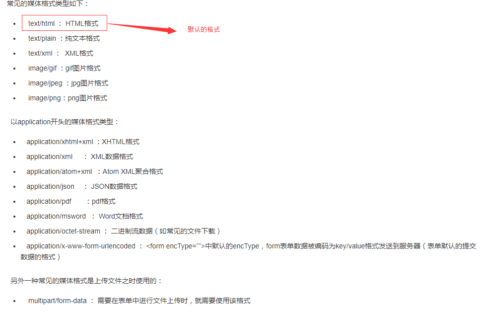
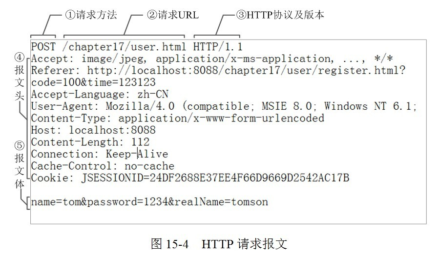

## HTTP协议概述
超文本传输协议（HTTP，HyperText Transfer Protocol)是互联网上应用最为广泛的一种网络协议。所有的WWW文件都必须遵守这个标准。设计HTTP最初的目的是为了**提供一种发布和接收HTML页面的方法**。1960年美国人Ted Nelson构思了一种通过计算机处理文本信息的方法，并称之为超文本（hypertext）,这成为了HTTP超文本传输协议标准架构的发展根基。Ted Nelson组织协调万维网协会（World Wide Web Consortium）和互联网工程工作小组（Internet Engineering Task Force ）共同合作研究，最终发布了一系列的RFC，其中著名的RFC 2616定义了HTTP 1.1。

HTTP是一个**应用层协议**,由请求和响应构成,是一个标准的个客户端和服务器模型, HTTP是一个**无状态**的协议。

通常，由HTTP客户端发起一个请求，建立一个到服务器指定端口（**默认是80端口**）的TCP连接。HTTP服务器则在那个端口监听客户端发送过来的请求。一旦收到请求，服务器（向客户端）发回一个状态行，比如`"HTTP/1.1 200 OK"`，和（响应的）消息，消息的消息体可能是请求的文件、错误消息、或者其它一些信息（*基于请求/响应模型的协议，先有请求后有响应*）。<u>HTTP使用TCP而不是UDP的原因在于（打开）一个网页必须传送很多数据，而TCP协议提供传输控制，按顺序组织数据，和错误纠正。</u>

>http请求包括:请求行、请求头、请求体            
>http响应包括:响应行、响应头、响应体

## HTTP协议的主要特点

- 简单：客户向服务器请求服务时，只需传送请求方法和路径。请求方法常用的有`GET、HEAD、POST`。每种方法规定了客户与服务器联系的不同类型。由于HTTP协议简单，使得HTTP服务器的程序规模小，因而通信速度很快。

- 灵活：HTTP允许传输任意类型的数据对象.正在传输的类型由Content-Type加以标记.常见的Content-Type的取值如下:

- 无连接：无连接的含义是限制每次连接只处理一个请求.服务器处理完客户端的请求,然后响应,并收到应答之后,就断开连接.这种方式可以节省传输时间.

- 无状态：HTTP协议是无状态协议.无状态是指协议 对于事务处理没有记忆能力。这种方式的一个坏处就是,如果后续的处理需要用到之前的信息,则必须要重传,这样就导致了每次连接传输的数据量增大；好处就是,如果后续的连接不需要之前提供的信息,响应就会比较快.而为了解决HTTP的无状态特性,出现了Cookie和Session技术。

> cookie 可以标识一个用户，用户首次访问一个站点时，可能需要提供一个用户标识（可能是名字）。在后续会话中，浏览器想服务器传递一个cookie首部，从而向服务器标识了用户。

## HTTP协议之URL

HTTP协议是一个基于请求和应答模式的,存在于传输层之上的应用层协议,是一个无状态的协议,通常是基于TCP的连接方式。HTTP的URL是一种特殊类型的URI,包含了用于定位查找某个网络资源的路径,格式如下:     
`http://host[':'port][abs_path]`

`http`表示通过http协议来定位网络资源; `host`表示合法的Internet主机域名或者IP地址;`port`指定一个端口,如果缺省,默认是80端口.`abs_path`表示的是请求的资源的URL,如果什么都没写,则浏览器会帮我们加上`/`,作为初始的路径地址。

## HTTP协议请求
http请求由三部分组成，分别是：请求行、消息报头、请求正文。

下面是一个请求报文：

①是请求方法，`GET`和`POST`是最常见的`HTTP`方法，除此以外还包括`DELETE`、`HEAD`、`OPTIONS`、`PUT`、`TRACE`。不过，当前的大多数浏览器只支持`GET`和`POST`。

②为请求对应的URL地址，它和报文头的Host属性组成完整的请求URL。

③是协议名称及版本号。

④是HTTP的报文头，报文头包含若干个属性，格式为“属性名:属性值”，服务端据此获取客户端的信息。

⑤是报文体，它将一个页面表单中的组件值通过param1=value1&param2=value2的键值对形式编码成一个格式化串，它承载多个请求参数的数据。不但报文体可以传递请求参数，请求URL也可以通过类似于“/chapter15/user.html? param1=value1&param2=value2”的方式传递请求参数。

- **get请求**:

将请求参数追加在url后面，不安全

url长度限制get请求方式数据的大小

没有请求体

一般的HTTP请求大多都是GET。

- **post请求**：

请求参数在请求体处，较安全。

请求数据大小没有显示

只有表单设置为method=“post”才是post请求，其他都是get请求

常见get请求:地址栏直接访问、`<a href="">`、`` 等

>从参数的传递方面来看,GET请求的参数是直接拼接在地址栏URL的后面,而POST请求的参数是放到请求体里面的.
> 
> 从长度限制方面来看,GET请求有具体的长度限制,一般不超过1024KB,而POST理论上没有,但是浏览器一般都有一个界限.
> 
> 从安全方面来看,GET请求相较于POST,因为数据都是明文显示在URL上面的,所以安全和私密性不如POST
> 
> 从本质上来说,GET和POST都是TCP连接,并无实质的区别.但是由于HTTP/浏览器的限定,导致它们在应用过程中体现出了一些不同.GET产生一个数据包,POST产生两个数据包.对于GET请求,浏览器会把http header 和 data 一并发出去,服务器响应200(返回数据).而对于POST,浏览器先发送header,服务器响应100 continue,浏览器再发送data,服务器响应200 ok

- **HEAD请求**:

HEAD跟GET相似，不过服务端接收到HEAD请求时只返回响应头，不发送响应内容。所以，如果只需要查看某个页面的状态时，用HEAD更高效，因为省去了传输页面内容的时间。

- **DELETE请求**：

删除某一个资源。

- **OPTIONS请求**：

用于获取当前URL所支持的方法。若请求成功，会在HTTP头中包含一个名为“Allow”的头，值是所支持的方法，如“GET, POST”。

- **PUT请求**：

把一个资源存放在指定的位置上。

本质上来讲， PUT和POST极为相似，都是向服务器发送数据，但它们之间有一个重要区别，PUT通常指定了资源的存放位置，而POST则没有，POST的数据存放位置由服务器自己决定。

- **TRACE请求**：

回显服务器收到的请求，主要用于测试或诊断。

- **CONNECT请求**：

CONNECT方法是HTTP/1.1协议预留的，能够将连接改为管道方式的代理服务器。通常用于SSL加密服务器的链接与非加密的HTTP代理服务器的通信。

https://blog.csdn.net/weixin_38087538/article/details/82838762

https://www.jianshu.com/p/7c8b4576e4bb

https://www.cnblogs.com/an-wen/p/11180076.html

http://blog.chinaunix.net/uid-24948645-id-3219484.html?/18382.html

