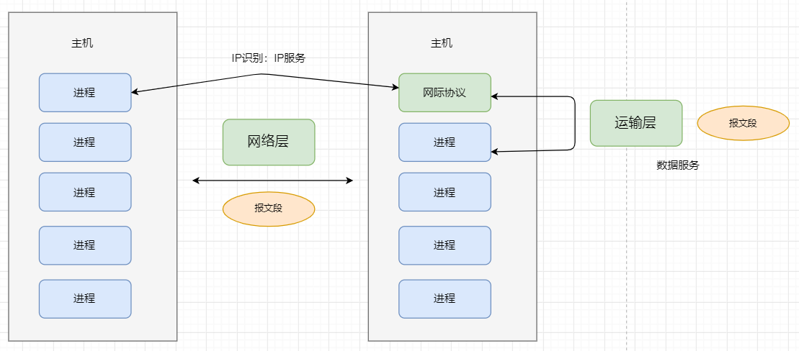
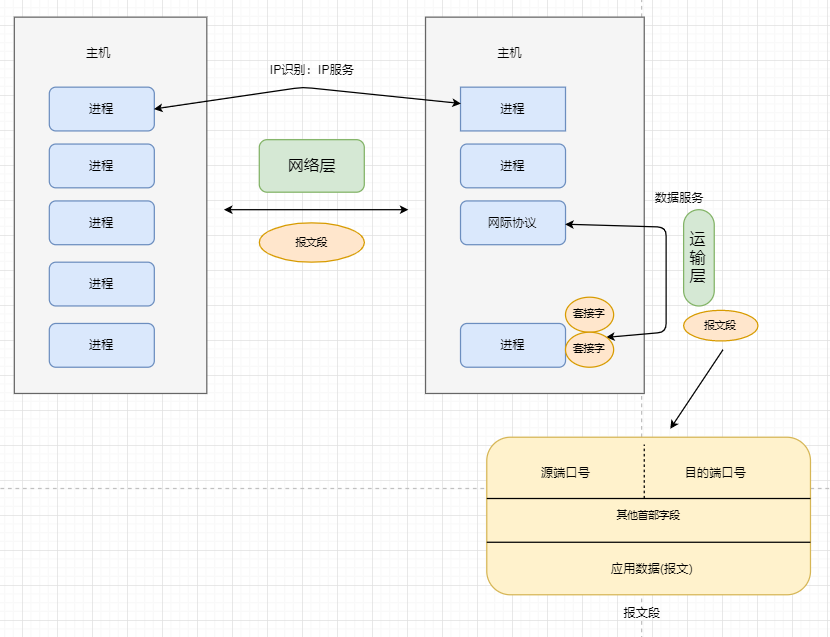

## 运输层报文段的传输

网络层提供的是主机之间的逻辑通信，也就是主机与主机之间的报文段传输。

运输层提供的是不同主机上的进程之间提供了逻辑通信，也就是同一个主机的不同进程之间的报文段的传输。

运输层的 **多路复用** 与 **多路分解**: 将主机间交付扩展到进程间交付。

一个进程有一个或者多个套接字，它是从进程传递数据和从网络传递数据的桥梁。

运输层实际上并没有直接将数据交付给进程，而是将数据交给了一个中间的套接字。每个套接字都有唯一的标识符。那么报文段是怎么定向到套接字的呢？            
每个运输层报文段具有几个字段，在接收端，运输层检查这些字段，标识出接收套接字，进而将报文段定向到该套接字。将运输层报文段中的数据交付到正确的套接字的工作叫**多路分解**。在源主机从不同套接字中收集数据块，并为每个数据块封装上首部信息（以后用于分解）从而生成报文段，然后将报文传递到网络层，所有这些工作成为**多路复用**。
- 多路分解：主机 --> 进程
- 多路复用：进程 --> 主机

