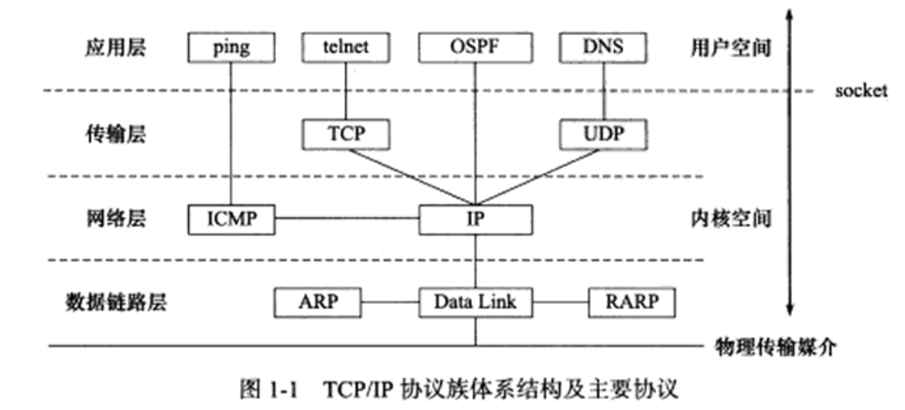
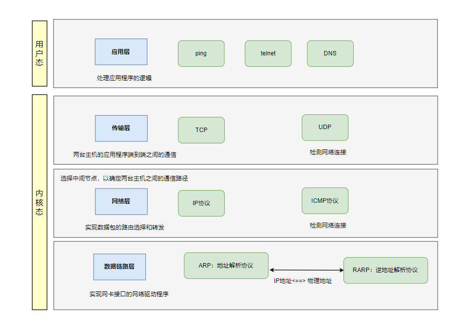
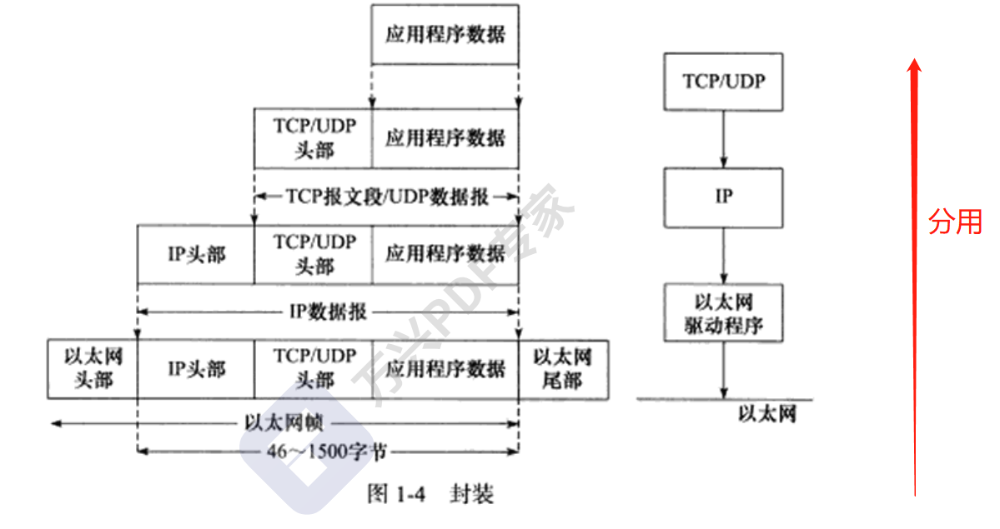

# 第1章 tcp/ip协议族

## 1.1 TCP/IP协议族体系结构
`TCP/IP`协议族有四层，分别是：数据链路层、网络层、传输层 和 应用层。

数据链路层有两个重要的协议：
- ARP:地址解析解析
- RARP：逆地址解析协议

网路层通过`IP`地址寻址一台机器，数据链路层通过 物理地址 寻址一台机器，因此网络层必须将目标机器的`IP`地址转成其物理地址。

## 1.2 封装

多个用户使用一个`IO`资源 发送消息 时，我们称之为“复用”。

多个用户使用一个`IO`资源 接收消息 时，我们称之为 “分用” 。

- 在网络层

局域网内多个主机利用一个路由网关发送消息给互联网的其他主机。这也是复用技术。

同理，利用网关接收路由数据报就叫 分用技术。

- 在运输层

操作系统的 多个进程（这里一个端口表示一个进程） 利用一个运输层协议（或者称为运输层接口）发送数据称为复用

同理，接收时叫做 分用。

- 在应用层

操作系统的 多个线程 利用一个端口（或者叫`socket,socket = IP+端口号` ）发送消息称为“”复用“”（有一个技术名词“”IO多路复用“”讲着的大概就是这个意思）

同理，接收时叫分用

